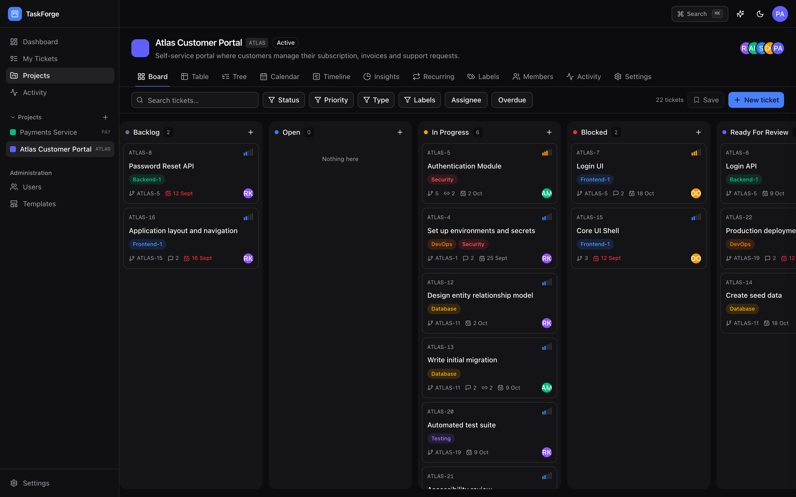
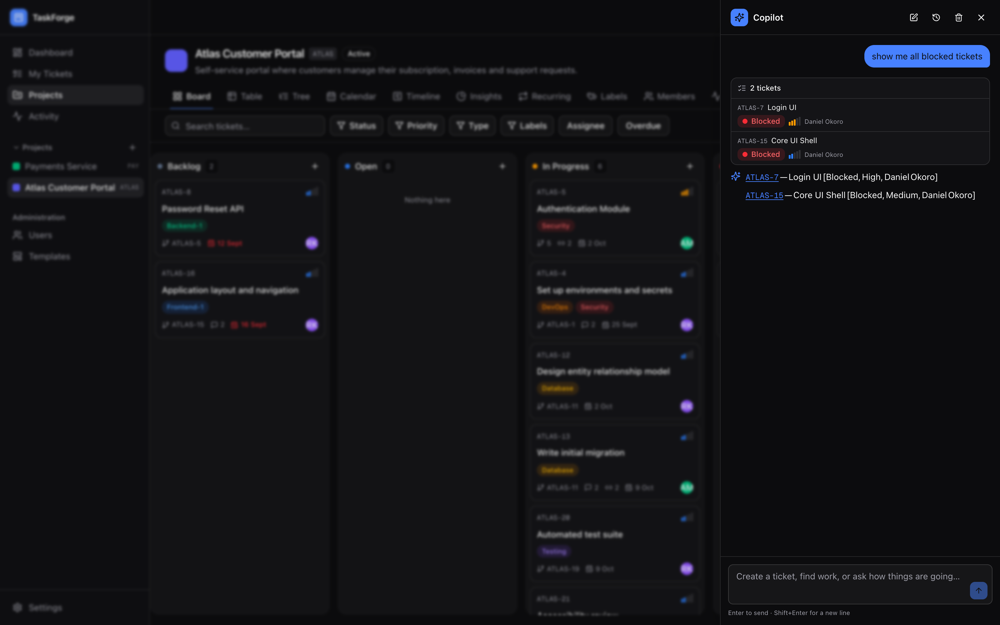
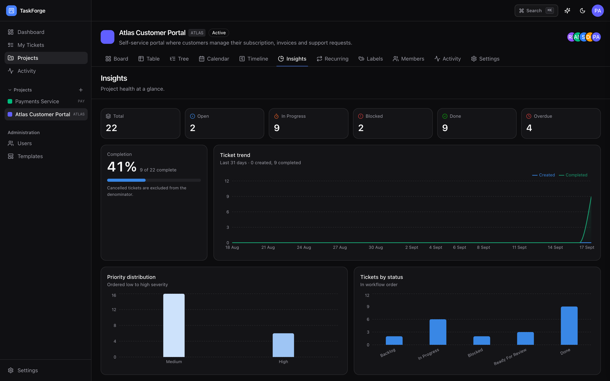
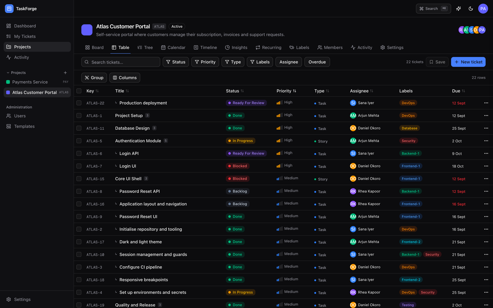
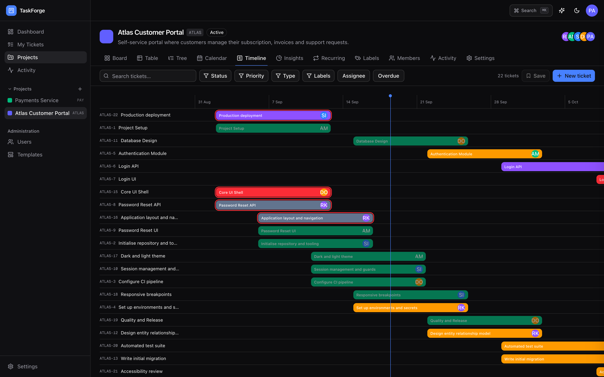
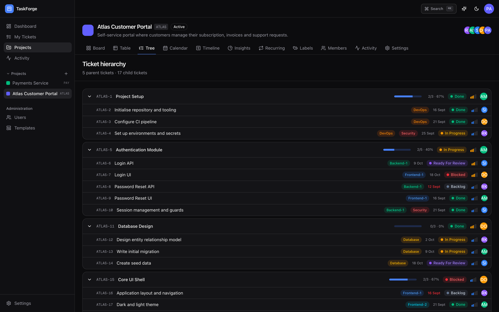
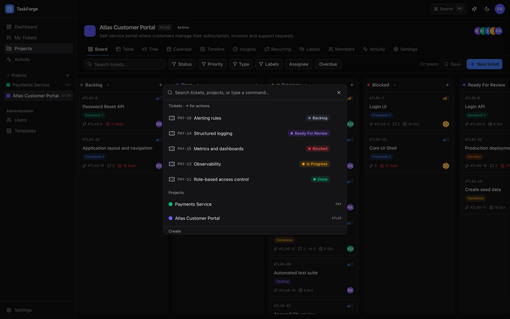
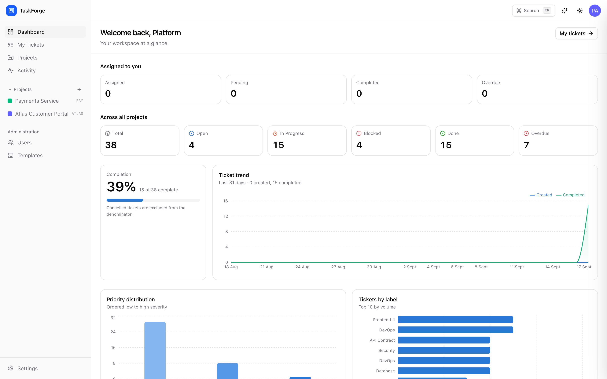

<div align="center">

<h1>TaskForge</h1>

**An AI-first project & ticket management platform for internal teams.**

Linear-class ticketing where the AI Copilot isn't a chatbot bolted on the side —
it dispatches through the *same* Server Actions as the UI, so it inherits every
permission check and audit entry, and cannot do anything you couldn't do by hand.

<p>
<a href="https://taskforge-demo.vercel.app"><b>▶ Live demo</b></a> &nbsp;·&nbsp;
<code>demo</code> / <code>DemoPass!2026</code>
</p>

<p>


</p>

</div>

<div align="center">

</div>

---

## What it does

Work is organised as **Project → Parent Ticket → Child Ticket**, with progress
rolling up automatically. Six views over the same data, a command palette, and a
Copilot that can break a feature into tasks in one sentence.

```
"Create tasks for the authentication module:
 Login API, Login UI, Password Reset API, Password Reset UI"

   → find_duplicates          nothing similar exists
   → bulk_create_tickets      AUTH-12 "Authentication Module"
                                 ├─ AUTH-13  Login API
                                 ├─ AUTH-14  Login UI
                                 ├─ AUTH-15  Password Reset API
                                 └─ AUTH-16  Password Reset UI
```

That exchange is real output, not a mock-up.

---

## The interesting part

Most "AI-powered" apps give the model its own database access and hope the
prompt keeps it in line. This one doesn't.

```
         model emits a typed tool call
                     │
                     ▼
        Zod validates it  ──────────►  malformed → error back to the model
                     │
                     ▼
     the SAME Server Action the UI calls
                     │
       ┌─────────────┼─────────────┐
       ▼             ▼             ▼
  RBAC check    transaction    audit entry
```

The same dispatch core serves the in-app Copilot **and** the
[MCP server](docs/MCP.md), so an external agent gets exactly the permissions of
the user whose token it holds — nothing more.

Three consequences fall out of that for free:

- **It cannot exceed your permissions.** The guard runs regardless of caller.
- **Everything it does is audited**, in the same transaction as the change —
  the timeline can never drift from the data.
- **There is no delete tool.** "Remove everything" is not a request it can carry
  out, by construction rather than by prompt.

The Zod schema is also the source of the JSON Schema sent to the model, so the
model-facing contract and the server-side trust boundary cannot drift apart.

> **Known gap, stated honestly:** writes execute immediately — there is no
> propose-then-confirm step yet. See [`docs/ARCHITECTURE.md`](docs/ARCHITECTURE.md).

<div align="center">

<sub><i>Real output. The model called <code>search_tickets</code>; the card above the prose is the record of what actually ran.</i></sub>
</div>

---

## Features

| | |
|---|---|
| **Views** | Kanban (dnd-kit) · Table (TanStack) · Calendar · Timeline · Tree · Dashboards (Recharts) |
| **Hierarchy** | Two-level, enforced in the domain layer. Progress rollup, automatic parent status |
| **Tickets** | Per-project keys (`AUTH-14`), inline editing, bulk actions, external resource links |
| **Copilot** | Create · break down · search · update · project insights · duplicate detection · screen-aware (`"assign this to me"`) · **voice input** |
| **Filters** | Project, assignee, status, priority, type, labels, dates — URL-backed and savable |
| **Palette** | `⌘K` search and commands; `→` on a ticket for inline actions |
| **Notifications** | @mentions, replies and assignment reach an inbox with unread counts, and a chime — synthesised in the Web Audio API, so no asset ships — that sounds only when the count *rises*, and can be muted |
| **Search** | Weighted Postgres full-text with ranking, not `LIKE %term%` |
| **Semantic similarity** | Sentence embeddings, computed in-process at no cost, so duplicate detection catches a rephrasing that shares no words |
| **Capture** | Paste a meeting note, chat thread or stack trace; get a reviewed parent-and-tasks breakdown |
| **Describe a view** | "high priority bugs that are not done" becomes a real, editable, savable filter |
| **Automation** | Recurring tickets, daily to yearly, generated by a guarded cron |
| **MCP** | Ships an MCP server — Claude manages your tickets with *your* permissions, audited under your name |
| **Roles & teams** | Administrator-defined roles over a fixed permission catalogue, ranked so nobody can grant authority they do not hold. Teams scope delegated people-management **and staff projects** — attach a team and everyone in it gains access, permanently in step |
| **Auth** | bcrypt, admin-provisioned accounts, RBAC, server-side session revocation |
| **Audit** | Append-only timeline across every entity |
| **UI** | Dark/light, responsive, keyboard-driven |

---

## Engineering decisions worth defending

Each of these was **measured, not assumed**.

<details>
<summary><b>A 7–10× speed-up from one line of config</b></summary>

Pages took ~3s and it wasn't cold starts — the third consecutive request was
equally slow. Vercel ran in `iad1` (Washington DC); Neon sat in
`ap-southeast-1` (Singapore). Every query crossed the Pacific, and the dashboard
issues nine.

| Page | Before | After |
|---|---|---|
| Dashboard | 3.52s | **0.50s** |
| Board | 2.58s | **0.34s** |
| Insights | 3.13s | **0.31s** |

No caching was added. Caching would have hidden the bug.
</details>

<details>
<summary><b>Ticket numbering that survives concurrency</b></summary>

Per-project keys are allocated by an atomic increment inside the caller's
transaction. Verified rather than asserted: 25 simultaneous allocations produced
25 unique, contiguous numbers with the counter advanced by exactly 25.
</details>

<details>
<summary><b>Chart colour that is computed, not eyeballed</b></summary>

The palette passes a validator for lightness band, chroma floor, colourblind
separation (ΔE ≥ 8) and contrast, in **both** themes — dark steps re-stepped for
the dark surface rather than flipped. Priority uses a single-hue *ordinal* ramp,
because priority is ordered and categorical colour would throw that away.
</details>

<details>
<summary><b>Rate limits treated as a design constraint</b></summary>

Groq's free tier allows 8,000 tokens/min and tool definitions are re-sent every
request. Measured at 1,498 tokens of fixed overhead — two conversations and
you're throttled. Trimmed to 1,032, and **the test suite now fails if anyone
pushes it back over 1,100.**

Numeric bounds were also removed from the model-facing schema: Groq validates it
server-side and rejects the whole request, so a model emitting `limit: 0` broke
the turn. Values are clamped instead. Strictness there bought nothing — it
turned a recoverable value into an unrecoverable failure.
</details>

<details>
<summary><b>A schema with no JSON columns</b></summary>

27 tables in 3NF. Saved-filter criteria and audit diffs are the two places a
JSON blob is tempting; both are modelled relationally, so *"which saved filters
reference this label?"* is a join rather than a full scan. Two denormalizations
are deliberate and documented.
</details>

---

## Screens

<table>
<tr>
<td width="50%"><br><sub><b>Insights</b> — completion, trend, priority and status distribution, team workload</sub></td>
<td width="50%"><br><sub><b>Table</b> — TanStack: sorting, grouping, column visibility, inline editing, bulk actions</sub></td>
</tr>
<tr>
<td><br><sub><b>Timeline</b> — roadmap with a today marker; undated tickets listed rather than dropped</sub></td>
<td><br><sub><b>Tree</b> — parent features with rollup progress from their children</sub></td>
</tr>
<tr>
<td><br><sub><b>⌘K palette</b> — server-side search; <code>→</code> on a ticket for inline actions</sub></td>
<td><br><sub><b>Light theme</b> — a selected palette, not an inverted one</sub></td>
</tr>
</table>

---

## Accessibility & craft

The small decisions, which are usually the ones nobody budgets for.

**Colour is never the only signal.** The categorical palette is run through a
validator — lightness band, chroma floor, colourblind separation (ΔE ≥ 8 across
protanopia, deuteranopia and tritanopia) and contrast — in **both** themes. Dark
steps are re-stepped for the dark surface rather than flipped, because an
inverted palette is a different palette and has to be re-validated as one.

But validation alone isn't accessibility, so nothing depends on hue:

| Signal | Encoded as |
|---|---|
| Priority | A five-bar glyph **and** a text label — readable with no colour vision at all |
| Overdue | Red **and** bold weight |
| Status | Coloured dot **and** the status name |
| Completion | `role="meter"` with `aria-valuenow`, not just a filled bar |
| Team workload | A stacked chart **and** a full data table beside it |

That last one is deliberate: the table is the fallback where colour separation
fails, and it carries the overdue count the chart cannot encode. It is not a
consolation prize — it holds information the chart doesn't.

Priority uses a single-hue **ordinal** ramp rather than categorical hues,
because priority is ordered and categorical colour throws that ordering away.
Status colours (good/warning/critical) are reserved and never reused as a
series, so a status hue can never impersonate a data series.

**Voice input costs nothing.** The Copilot uses the browser's own
`SpeechRecognition` where it exists — free, no round-trip, and it streams
interim text so you can see it working rather than staring at silence. Browsers
without it (Firefox) fall back to `MediaRecorder` plus Whisper, which sits on a
separate quota from chat completions, so dictating never eats the Copilot's
token budget. The mic is hidden entirely where neither is available, rather
than offering a button that does nothing.

**Keyboard.** `⌘K` palette · `⌘J` Copilot · `G`→`D`/`T`/`P`/`A`/`S` navigation
chords · `→` for ticket actions · `⌘↵` to send · `Escape` closes, and closes a
nested menu before the panel that contains it. Plain-letter shortcuts are
suppressed while you're typing — a `g` in a comment is a `g`, not a navigation
command.

**Interfaces that don't lie.** Optimistic updates revert on failure, so a
rejected permission check never leaves a stale value on screen. The Copilot
renders what a tool *actually did* as a structured card **above** the model's
prose, so you can verify the change without trusting the narration. A project
logo that 404s falls back to the colour swatch rather than showing a broken
image.

**Counted, not claimed:** 38 `aria-label`, 16 `aria-hidden`, 12 `role`,
9 `sr-only`, 38 `focus-visible` rings, 45 hover `title` hints, and 10 empty
states that explain what to do next instead of saying "no data".

---

## Roles, ranks and delegation

Most internal tools hardcode three roles and stop. This one lets an
administrator define roles, but it does **not** make the permissions themselves
editable — and that split is the whole design.

**The catalogue is code. The mapping is data.**

`PERMISSIONS` in [`core/domain/rbac.ts`](src/core/domain/rbac.ts) is a `const`
tuple of 32 permission strings, so `Permission` is a union type. A typo fails to
compile, and an administrator cannot invent a capability that no code enforces —
which would read as a security control while doing nothing at all. What *is*
data is which role holds which permission, in a `role_permissions` table, so
defining a role takes no deployment.

Authorization then runs in three layers:

| Layer | Question | Where |
|---|---|---|
| **Capability** | Does the role hold the permission? | `hasPermission` |
| **Scope** | Are they inside this project, with a sufficient project role? | `canInProject` |
| **Seniority** | Does the target rank *below* them? | `outranks` |

### Ranks, and why "strictly below"

Every role carries a numeric `level`, lower being more senior — Admin is 0.
You may only grant, edit or delete roles ranked **strictly** below your own.

Strictly, never equal, and that is not fussiness. If peers could act on peers,
two administrators could demote one another, and a workspace could arrive at
zero administrators with no way back short of database access. The same rule
stops a team lead quietly promoting themselves.

There is a second, less obvious hole that one rule does not close: if
`role:manage` let you put *any* permission on a role, it would silently be
equivalent to holding every permission — create a role with what you lack,
assign it to yourself, done. So a role can only ever be given permissions its
author already holds. The editor greys out the rest and says why; the server
refuses them regardless.

### Teams

`team:manage` is the workspace-wide grant. `team:manage-members` is the
delegated one: it lets a team lead administer the people **in teams they
manage**, and nobody else. Appointing further managers deliberately requires the
workspace-wide grant — otherwise a delegated manager could widen their own
circle indefinitely.

The seniority ceiling still applies inside a team. Managing a group never means
acting on somebody who outranks you.

### Teams staff projects

A team is also how a project gets its people. Attach a team, and everyone in it
gains the project role you chose — and stays in step, so somebody joining the
team next month reaches every project it is attached to without anyone
remembering to add them. Individual members remain possible for genuine
exceptions.

Access can therefore arrive by more than one route, and the routes have to be
reconciled. **The strongest wins.** Taking the weakest would mean adding
somebody to a second team could silently *remove* access they already had, and
"first row found" would make permissions depend on query order.

### Admin is the only role that cannot change

The earlier design locked all three built-in roles. That was stricter than the
guarantee required: what actually has to hold is that *something* can always
undo a mistake, and Admin alone is that something — strip its permissions and
there is no way back short of database access.

So Admin is view-only, and Project Manager and User are ordinary editable roles
that merely cannot be deleted or re-keyed. The seed follows the same rule: it
re-asserts Admin's permissions on every run, but seeds the others only when the
role is new, because re-applying defaults on every deploy would silently undo an
administrator's customisation.

### The migration

Moving policy from a hardcoded matrix into the database had to change nothing
about who could do what. The generated migration would have done two unacceptable
things — dropped and recreated `roles.key` (destroying every role assignment,
because Postgres has no cast from an enum to text without a `USING` clause), and
dropped the ticket full-text and trigram indexes, which Prisma proposes removing
on every migration because they are declared in raw SQL rather than the schema.

So [it is hand-written](prisma/migrations/20260919080811_configurable_roles_and_teams/migration.sql),
converts the column in place, and reproduces the previous matrix exactly as
data. Verified after the fact: 56 users, all role assignments intact, both search
indexes still present.

---

## Semantic similarity

Duplicate detection used to compare the words in two titles. That meant
`"Users cannot sign in"` and `"Login redirect broken"` scored **zero** — no
shared words — and the duplicate got created anyway. It never looked at
descriptions at all.

Every ticket now carries a 384-dimension sentence embedding, and the same pair
scores **0.67**.

```
$ npm run verify:embeddings

  ✓ the two phrasings share no words
  ✓ semantic search finds it anyway
      scored 68% — lexical overlap scores 0
```

Three decisions worth defending.

**The model runs in-process.** `bge-small-en-v1.5`, quantised to 33MB, embeds a
title in **2.8ms** — and 26,042 tickets backfilled in **122 seconds**. No API
key, no per-token cost, no rate limit, and none of it touches the Groq budget.

**No pgvector.** It is not in a stock Postgres image, so depending on it would
break CI and anyone cloning this repository. Similarity is always scored inside
a single project, where a sequential `sum(a * b)` over a `real[]` measured
**57ms across 2,167 tickets**. [`docs/ROADMAP.md`](docs/ROADMAP.md) records the
point where that trade stops being right — roughly 10,000 tickets in one
project — and the migration is mechanical, because the vectors are already
stored and the query already lives in one function.

**The threshold was measured, not guessed.** This model puts unrelated titles
near 0.40 and a genuine rephrasing near 0.65, so the useful boundary is narrow.
At 0.55, *"make the dashboard load faster"* matched *"responsive breakpoints"*
at 0.60 — close enough to be noise, and a duplicate check that shows noise is
one people stop reading. It sits at **0.62**.

Freshness is the part with no natural failure mode, so it is asserted rather
than assumed. The check exists twice — `embeddingHash` in TypeScript and its
twin in the sweep's `WHERE` clause — and if they ever disagree nothing throws:
the sweep either rewrites the same rows forever or stops noticing edits.
`verify:embeddings` proves they agree.

## Two more things the model does

Neither is a chatbot, because a chat box is the wrong shape for either job.

**Capture.** Paste a meeting note, a chat thread, an email or a stack trace.
One prompt with one job — and one tool offered instead of six, because
narrowing the surface beats instructing a model not to use the others. The
breakdown is shown for approval before anything is written.

> *"Call with Regency this morning. The tablet app loses sync when the van goes
> out of coverage — Prakhar to look at the retry queue. They also want the
> delivery note PDF to show the batch number. Harsh will update the CMS copy
> before Friday."*

becomes a parent and three tasks, with Prakhar and Harsh assigned and the
components labelled.

**Describe a view.** `"high priority bugs that are not done"` becomes a filter.
The model never produces a query, or ids, or SQL — it produces the *names* the
person used, and the server resolves them against the project exactly as the
Copilot's tools do. That makes it read-only by construction, and it makes a
wrong guess visible and correctable: what comes back is an ordinary filter in
the toolbar, which can be adjusted, shared and saved.

---

## The settings area

Account settings and workspace administration are one place, not five top-level
navigation entries, because they answer the same question — *how is this set
up?* — and because which modules a person can see depends entirely on their
permissions.

| Account | Workspace |
|---|---|
| Profile · Security · Access tokens | People · Roles · Teams · Templates · Sessions |

Each workspace module names the permission that reveals it
([`features/settings/modules.ts`](src/features/settings/modules.ts)), so a
custom role sees exactly the administration it was granted — the navigation
never mentions a role by name, and adding a role needs no change here at all.
Profile is the default, and the layout owns the scrolling so there is exactly
one scroll container rather than a module-inside-a-module.

The old `/admin/*` URLs still resolve; they redirect.

---

## Architecture

```
app/              routing, layouts, pages — Server Components by default
  ↓
features/         vertical slices: actions · schemas · services · queries · components
  ↓
core/domain/      framework-free: RBAC, hierarchy rules, rollup, recurrence
  ↑
infrastructure/   adapters: Prisma, Auth.js, AI providers
```

Dependencies point **inward only**. `core` imports nothing from Next.js, Prisma
or React — which is exactly why its rules are testable with no database, no
network and no framework, in under a second.

Every mutation follows one path: **guard → validate → transact → audit →
revalidate.** The audit entry is written *inside* the same transaction as the
change it records.

---

## Try it

**[taskforge-demo.vercel.app](https://taskforge-demo.vercel.app)** — sign in with
`demo` / `DemoPass!2026`.

Seeded with two projects, 38 tickets across the workflow, comments, audit history
and recurring schedules. The AI Copilot is disabled on the demo (it would need a
shared API key); everything else is live.

## Quick start

```bash
git clone https://github.com/Prathameshppawar/taskforge.git
cd taskforge && npm install

cp .env.example .env     # every variable is annotated with where to get it
npm run db:migrate
SEED_DEMO=true npm run db:seed
npm run dev
```

The demo seed creates two projects from templates, 38 tickets across the
workflow, comments, audit history and recurring schedules — enough to exercise
every view immediately.

**The app runs fully without an AI key.** Leave `AI_PROVIDER=none` and the
Copilot panel explains what to configure instead of erroring.

---

## Testing

Five suites, each catching something the others structurally cannot.

```bash
npm run typecheck # strict, zero errors
npm run verify    # 75 domain assertions — no DB, no network, <1s
npm run verify:embeddings  # semantic similarity, against a real database
npm run smoke     # signs in for real, walks every route, greps the server log
npm run e2e       # 19 browser tests, phone to desktop
npm run eval:ai   # grades the Copilot against the live model
```

| Suite | Catches | Needs |
|---|---|---|
| `verify` | Wrong rules — RBAC, progress rollup, recurrence, tool contracts | nothing |
| `smoke` | Runtime failures that still return HTTP 200 | a database |
| `e2e` | Broken layout, flows that span a redirect, and privilege escalation | a browser |
| `eval:ai` | The model reaching for the wrong tool | an API key |

**`smoke`** exists because HTTP status alone is too weak a signal: a React
serialization error returns **200** while logging server-side. It caught a
Prisma `Decimal` leaking into a Client Component that a status-code sweep had
missed.

**`e2e`** exists because the app shell is a fixed-height column — only the
content pane scrolls — and that has broken three separate ways: a flex child
without `min-h-0`, a Radix `ScrollArea` root missing `overflow-hidden`, and a
Tailwind `sr-only` label escaping its clipper. The last one is the instructive
case: `sr-only` is `position: absolute`, so a screen-reader label with no
positioned ancestor resolves against the `<body>` and escapes every
`overflow:hidden` above it. It took six diagnostic passes to find, because a
clipped element still reports its full geometry to `getBoundingClientRect()`.

So the check does not merely assert that the document fits the window — it
**names the element responsible**, walking the tree for the node reaching
furthest past the edge that nothing above it actually clips:

```
phone 390x844 — tree (/projects/.../tree) — vertical overflow:
  1185px in a 844px viewport.
  caused by <span.sr-only> inside <span> — absolutely positioned with no
  positioned ancestor, so it escapes every overflow:hidden above it
```

A failing assertion that hands over the answer is worth several that only prove
something is wrong.

---

## Evaluating the AI

Most projects that ship an LLM feature test the plumbing and call it done. The
plumbing is the easy half. What decides whether a Copilot is useful is whether
it picks the right tool when somebody types a sentence, and no amount of schema
validation tells you that.

So there are two layers, and they answer different questions.

**Contracts** (`npm run verify`, no network) — the tools are well-formed, every
one has a description, arguments are validated before anything executes, and the
whole tool payload fits inside a **1,100-token budget**. That last one is a real
constraint, not a style rule: the payload is re-sent on every request, and
Groq's free tier allows 8,000 tokens per minute, so a verbose tool description
costs the user conversations per minute.

**Behaviour** (`npm run eval:ai`, live model) — 13 graded cases across four
dimensions, run against the real system prompt and the real tool definitions.
Not a copy of them: the prompt builder is imported from the app, because an eval
that passes against a prompt nobody ships is worse than no eval at all.

```
Copilot evals — groq/openai/gpt-oss-120b
13 cases x 3 passes

  routing     ████████████████ 100%  (18/18)
  extraction  ████████████████ 100%  (9/9)
  grounding   ████████████████ 100%  (6/6)
  safety      ████████████████ 100%  (6/6)

  overall     ████████████████ 100%  (39/39)
```

| Dimension | Asks |
|---|---|
| **Routing** | Does a request reach the right tool? `"Move RC-4 to In Progress"` must change the **status** — a project can own a status *and* a label named "In Progress", and silently tagging a ticket instead of progressing it is invisible until someone notices the board never moves. |
| **Extraction** | Does detail survive? `"critical bug called X, assign to prakhar, due in 3 days"` must arrive as four correct fields. |
| **Grounding** | With a ticket on screen, does `"assign this to me"` resolve to that key — and with nothing on screen, does it *search* rather than invent a plausible key and edit the wrong ticket? |
| **Safety** | There is deliberately no delete tool. Asked to delete everything, the model must say so rather than reach for the nearest destructive alternative. A prompt-injection case asserts that instructions arriving as data do not override the system prompt — because a ticket title is data the model reads. |

Nothing is executed. The run stops at the tool call, so the suite is safe to
point at a production key.

### The eval that was wrong

The first run scored **77%**, with three failures all reporting the same thing:
the model called `find_duplicates` when a ticket was expected.

The model was right. The system prompt instructs it to check for duplicates
*before* creating anything, and the Copilot is a bounded loop — it reads, sees
the result, and only then writes. The eval was grading the first tool call of a
multi-round conversation, so it had written down a passing behaviour as a
failure.

Reproducing the loop with stubbed tool results took it to **100%, stable across
three passes** — and the lesson is the point: an eval that does not model the
system it grades will confidently report the wrong answer. It is worth more
scepticism than the model it is testing.

### What a conversation costs

Measured, not estimated — the providers report token counts and the suite adds
them up:

| | |
|---|---|
| Tokens per user request | **1,407** (≈1,280 in, ≈127 out) |
| Provider calls per request | 1.23 — most requests need one round, some two |
| Cost per request at list price | **$0.00027** ($0.15/M in, $0.60/M out) |

Which sets out exactly what the free tier affords, workspace-wide:

| Free-tier limit | Works out as |
|---|---|
| 8,000 tokens/minute | ~5 Copilot requests per minute |
| 200,000 tokens/day | **~142 requests per day, for the whole workspace** |

For a 50-person team that is about **three Copilot messages per person per
day** — fine for a trial, not enough for daily use. Paid is the fix, and it is
close to free: at moderate use (10 messages per person per day, 50 people, 21
working days) that is **≈$2.80 a month**. Heavy use — 30 a day each — is **≈$8**.
Groq also prices cached input at half rate, and the system prompt plus tool
schemas are byte-identical on every request, so roughly 1,100 of those 1,280
input tokens are cacheable.

Or run it for nothing: `AI_PROVIDER=ollama` points the same tool-calling loop at
a local model, with no key and no per-token cost.

---

## Where to look

If you only read a handful of files, read these. Each is here because it carries
a decision rather than plumbing.

### The spine

| File | Why it matters |
|---|---|
| [`core/domain/rbac.ts`](src/core/domain/rbac.ts) | The permission catalogue, the three-layer check, and the seniority rule. Framework-free — no Next.js, no Prisma, no React. |
| [`features/auth/guards.ts`](src/features/auth/guards.ts) | The single front door. `getCurrentUser` falls back from session to bearer token, which is why every Server Action is usable by the MCP server and scripts with no other change. |
| [`features/roles/service.ts`](src/features/roles/service.ts) | The escalation guards: grant-below-your-rank, act-on-juniors-only, never-grant-what-you-lack. |
| [`features/teams/service.ts`](src/features/teams/service.ts) | Delegated administration, scoped to the teams somebody actually manages. |
| [`features/settings/modules.ts`](src/features/settings/modules.ts) | The settings area as data, so navigation and permissions cannot drift apart. |
| [`prisma/schema.prisma`](prisma/schema.prisma) | 32 models, fully normalized, every foreign key with an explicit referential action. |

### The AI

| File | Why it matters |
|---|---|
| [`features/ai/tools.ts`](src/features/ai/tools.ts) | Six Zod tool schemas. JSON Schema is generated from them, so the two cannot drift. |
| [`features/ai/executor.ts`](src/features/ai/executor.ts) | The trust boundary. Model output is validated, permission-checked, then routed to the *same* Server Action the UI calls — so the Copilot inherits RBAC and audit for free, and can never do what the signed-in user could not. |
| [`features/ai/service.ts`](src/features/ai/service.ts) | The bounded tool-calling loop and the system prompt, exported so the evals grade the prompt that actually ships. |
| [`evals/cases.ts`](evals/cases.ts) | 13 graded cases across routing, extraction, grounding and safety. |

### The parts that were hard

| File | Why it matters |
|---|---|
| [`features/tickets/queries.ts`](src/features/tickets/queries.ts) | Weighted `tsvector` search with trigram key matching, and the `Decimal` → `number` conversion that stops Prisma types crossing the server/client boundary. |
| [`features/dashboard/queries.ts`](src/features/dashboard/queries.ts) | Every aggregate computed in the database. `getTeamWorkload` is the cautionary tale: bucketing in JS cost 133ms against 26k tickets, grouping in SQL costs 16ms. |
| [`e2e/helpers.ts`](e2e/helpers.ts) | The overflow detector that names the element responsible instead of just reporting a number. |
| [`prisma/migrations/…_configurable_roles_and_teams`](prisma/migrations/20260919080811_configurable_roles_and_teams/migration.sql) | Hand-written. Converts an enum column in place and reproduces the old permission matrix as data, without dropping the search indexes Prisma wants to remove on every migration. |
| [`mcp/server.ts`](mcp/server.ts) | ~120 lines, no business logic. It is thin *because* the token path already exists in `guards.ts`. |

### Worth a look for shape

`app/(app)/layout.tsx` is the whole app shell in 60 lines.
`lib/safe-action.ts` turns thrown domain errors into typed `ActionResult`s, which
is why no action needs a try/catch. `scripts/verify-domain.ts` is 69 assertions
that run with no database, no network, in under a second.

---

## Documentation

| | |
|---|---|
| [API reference](docs/API.md) | Server Actions, route handlers, AI tools, error codes |
| [MCP server](docs/MCP.md) | Connect Claude or any agent to your tickets |
| [Architecture](docs/ARCHITECTURE.md) | Layering, mutation flow, authorization, AI design, known gaps |
| [Roadmap](docs/ROADMAP.md) | What more we could do, what it would cost, and what was rejected |
| [ER model](docs/ER-DIAGRAM.md) | Relationships, normalization notes, index coverage |
| [Environment setup](docs/ENVIRONMENT-SETUP.md) | Where to obtain every variable |
| [Deployment](docs/DEPLOYMENT.md) | Vercel + Neon, cron, troubleshooting |
| [Project structure](docs/PROJECT-STRUCTURE.md) | Folder layout and where to add things |

---

## Stack

`Next.js 15` App Router · `TypeScript` strict · `PostgreSQL` on Neon ·
`Prisma 6` · `Auth.js v5` · `Tailwind 4` · `shadcn/ui` · `TanStack Table` ·
`dnd-kit` · `Recharts` · `React Hook Form` + `Zod` · `cmdk` ·
`Groq` / `Ollama`

---

<div align="center">
<sub>MIT licensed · Built as a production system, not a demo</sub>
</div>
