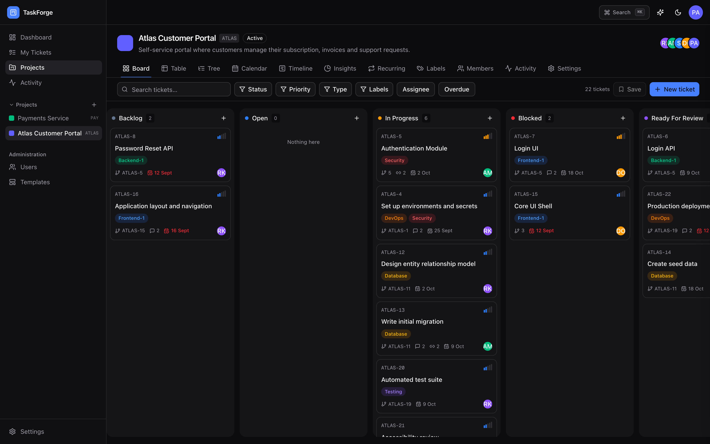
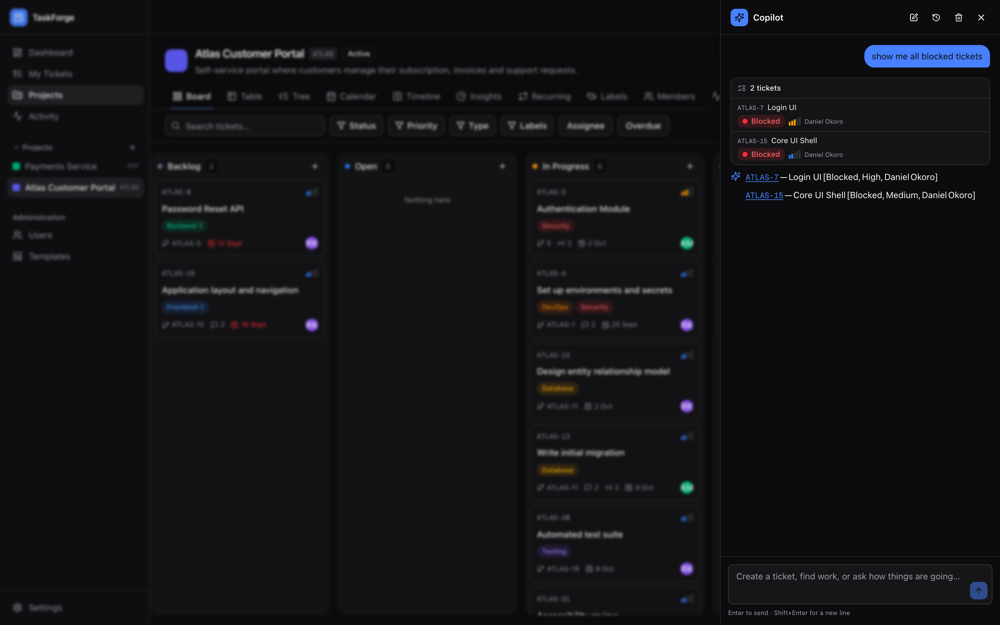
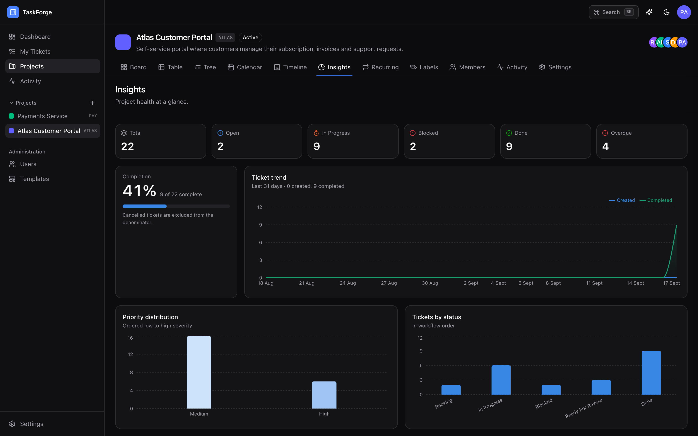
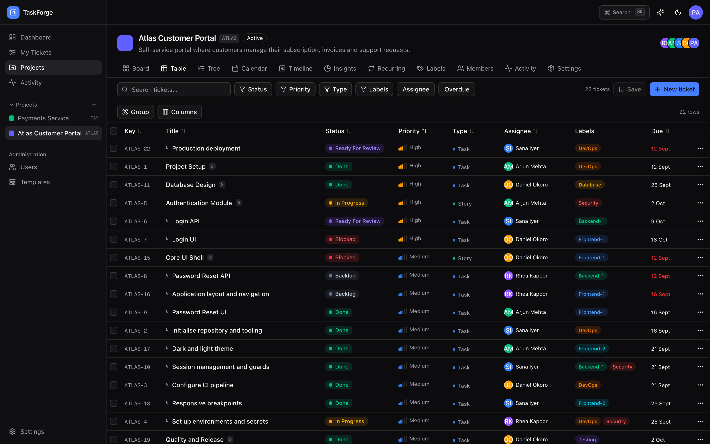
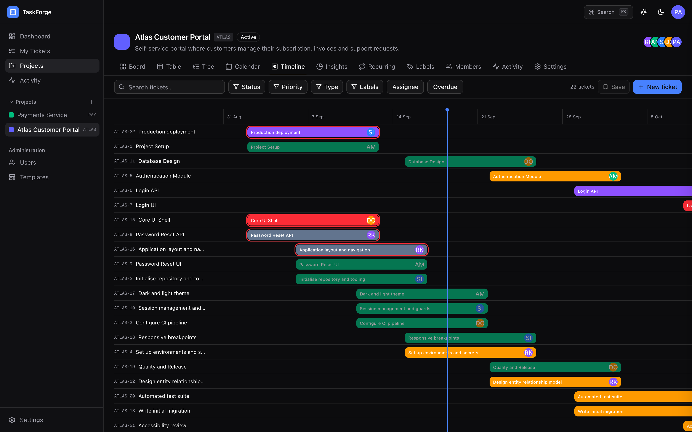
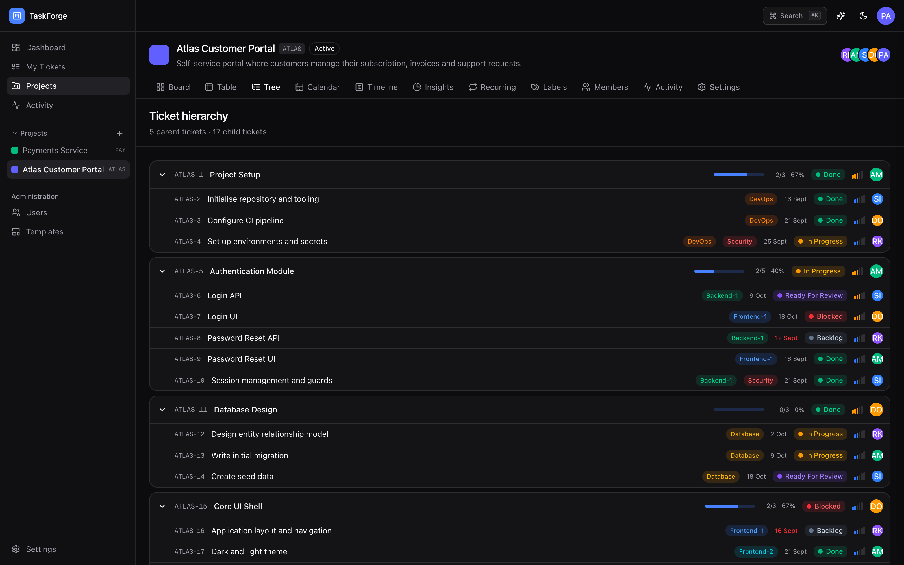
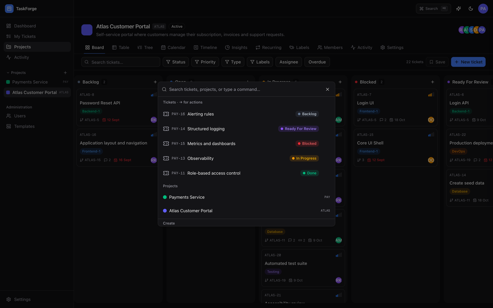
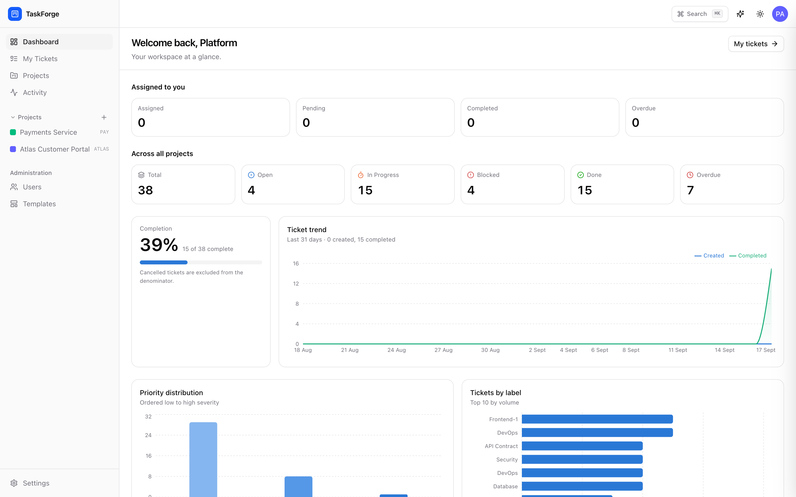

<div align="center">

<h1>TaskForge</h1>

**An AI-first project & ticket management platform for internal teams.**

Linear-class ticketing where the AI Copilot isn't a chatbot bolted on the side —
it dispatches through the *same* Server Actions as the UI, so it inherits every
permission check and audit entry, and cannot do anything you couldn't do by hand.

<p>
<a href="https://taskforge-demo.vercel.app"><b>▶ Live demo</b></a> &nbsp;·&nbsp;
<code>demo</code> / <code>DemoPass!2026</code>
</p>

<p>


</p>

</div>

<div align="center">

</div>

---

## What it does

Work is organised as **Project → Parent Ticket → Child Ticket**, with progress
rolling up automatically. Six views over the same data, a command palette, and a
Copilot that can break a feature into tasks in one sentence.

```
"Create tasks for the authentication module:
 Login API, Login UI, Password Reset API, Password Reset UI"

   → find_duplicates          nothing similar exists
   → bulk_create_tickets      AUTH-12 "Authentication Module"
                                 ├─ AUTH-13  Login API
                                 ├─ AUTH-14  Login UI
                                 ├─ AUTH-15  Password Reset API
                                 └─ AUTH-16  Password Reset UI
```

That exchange is real output, not a mock-up.

---

## The interesting part

Most "AI-powered" apps give the model its own database access and hope the
prompt keeps it in line. This one doesn't.

```
         model emits a typed tool call
                     │
                     ▼
        Zod validates it  ──────────►  malformed → error back to the model
                     │
                     ▼
     the SAME Server Action the UI calls
                     │
       ┌─────────────┼─────────────┐
       ▼             ▼             ▼
  RBAC check    transaction    audit entry
```

The same dispatch core serves the in-app Copilot **and** the
[MCP server](docs/MCP.md), so an external agent gets exactly the permissions of
the user whose token it holds — nothing more.

Three consequences fall out of that for free:

- **It cannot exceed your permissions.** The guard runs regardless of caller.
- **Everything it does is audited**, in the same transaction as the change —
  the timeline can never drift from the data.
- **There is no delete tool.** "Remove everything" is not a request it can carry
  out, by construction rather than by prompt.

The Zod schema is also the source of the JSON Schema sent to the model, so the
model-facing contract and the server-side trust boundary cannot drift apart.

> **Known gap, stated honestly:** writes execute immediately — there is no
> propose-then-confirm step yet. See [`docs/ARCHITECTURE.md`](docs/ARCHITECTURE.md).

<div align="center">

<sub><i>Real output. The model called <code>search_tickets</code>; the card above the prose is the record of what actually ran.</i></sub>
</div>

---

## Features

| | |
|---|---|
| **Views** | Kanban (dnd-kit) · Table (TanStack) · Calendar · Timeline · Tree · Dashboards (Recharts) |
| **Hierarchy** | Two-level, enforced in the domain layer. Progress rollup, automatic parent status |
| **Links** | `blocks` · `relates to` · `duplicates`, stored once and read from both ends; an unresolved blocker is surfaced on the ticket |
| **Watchers** | Follow a ticket without owning it — gated on *viewing*, because the people who most need to watch often should not be editing |
| **Attachments** | Screenshots and logs, served only to people who can already see the ticket |
| **Tickets** | Per-project keys (`AUTH-14`), inline editing, bulk actions, external resource links |
| **Writing** | Descriptions, remarks and comments in Markdown — headings, task lists, code, tables — with a toolbar, a preview, and nothing ever rendered as raw HTML |
| **Acceptance criteria** | A checklist of what must be true for a ticket to be done. People tick them; the Coder works against them; the Reviewer judges every pull request against each one |
| **Templates** | Each ticket type starts from its own description and criteria — a bug asks for steps to reproduce, a deployment for a rollback plan |
| **Flow** | Every status change recorded by a database trigger: time in each status on the ticket, "where work waits" per project, stuck cards flagged on the board, soft WIP limits per column |
| **Planning** | Sprints (one running at a time) and milestones (several at once, as client work runs), above a ranked backlog. Drag to plan and rank, fill to capacity, or ask the Planner; close with carry-over; a burn-up from recorded history per cycle |
| **Time** | A timer on every ticket that follows you in the header, entries typed as `1h 30m` or `1:30`, a weekly timesheet, time by person and kind on Insights, and billable hours — with the amount, at the project's rate — in the monthly client report |
| **Service targets** | Response and resolution hours per priority, for the kinds of ticket you choose. The resolution clock pauses while Blocked; alerts at 80% and on breach, once each |
| **Copilot** | Create · break down · search · read · comment · update · project insights · duplicate detection · screen-aware (`"assign this to me"`) · **voice input** · **slash commands that skip the model entirely** |
| **Filters** | Project, assignee, status, priority, type, labels, dates — URL-backed and savable |
| **Palette** | `⌘K` search and commands; `→` on a ticket for inline actions |
| **Notifications** | @mentions, replies and assignment reach an inbox with unread counts, and a chime — synthesised in the Web Audio API, so no asset ships — that sounds only when the count *rises*. Muting is a **property of the account**, not the browser, and **Settings → Notifications** can play the chime on demand so the choice is an informed one |
| **Search** | Weighted Postgres full-text with ranking, not `LIKE %term%` |
| **Semantic similarity** | Sentence embeddings, computed in-process at no cost, so duplicate detection catches a rephrasing that shares no words |
| **Capture** | Paste a meeting note, chat thread or stack trace; get a reviewed parent-and-tasks breakdown |
| **Describe a view** | "high priority bugs that are not done" becomes a real, editable, savable filter |
| **Export** | The view you are looking at, as Excel or CSV — filters and all |
| **Triage** | Type, priority and labels suggested from the project's own history, with the evidence shown |
| **Estimates** | "Similar work took 5 days" — from real cycle times, not a guess |
| **Weekly update** | A client-ready paragraph, written from counted facts |
| **GitHub** | One click creates TaskForge's own GitHub App. Branches, pull requests, commits and CI that mention `DEMO-2` land on that ticket, and move it forward — never back. A project can span several repositories |
| **Fix with AI** | One button on a ticket: a model reads the linked repository, stages a change, and TaskForge opens it as a pull request — Anthropic, OpenAI or Groq, pluggable. It never merges, never touches CI, and every step it took is on the ticket |
| **AI engines & spend** | Workspace → AI: pick each provider's model from the list its own API reports, store keys sealed, and see spend by person, project, engine and feature. Monthly budgets warn at 80% and 100% by email, and can hard-stop. Weekly usage reports go to subscribed people or whole teams |
| **Delivery loop** | Deploys tracked from GitHub (Vercel, Netlify, any host that reports there): preview links on tickets, "Live in Production", merged tickets move to Done when they ship. The AI can plan first, heal a red PR from its own CI logs, review any PR inline, and write release notes |
| **Production** | Errors from Sentry or any app become grouped, regression-aware tickets with suspect changes; uptime monitors open incidents and time the outage; post-mortems drafted from the record; one-click Vercel rollback; DORA metrics per project |
| **Autonomy, bounded** | AI pull requests can open as drafts until CI is green, and — under a narrow per-project policy — merge themselves. The Coder follows each repository's own conventions file, and its acceptance rate is tracked per repository |
| **Client portal** | Clients sign in to their own portal: file requests, try preview links, approve work waiting on them, and read a printable monthly report. AI spend per project is there for staff to bill against |
| **AI agents** | Coder, Planner, Reviewer, Release Manager, Triage and Ops are workspace members with their own names in history and usage — and can never sign in |
| **Ticket kinds** | Every type carries a fixed meaning — bug fix, production issue, deployment, feature, enhancement, research, task — so behaviour survives a rename |
| **Automation** | Recurring tickets, daily to yearly, generated by a guarded cron |
| **MCP** | Ships an MCP server — Claude reads, creates, updates and **comments on** your tickets with *your* permissions, audited under your name |
| **Roles & teams** | Administrator-defined roles over a fixed permission catalogue, ranked so nobody can grant authority they do not hold. Teams scope delegated people-management **and staff projects** — attach a team and everyone in it gains access, permanently in step |
| **Auth** | bcrypt, admin-provisioned accounts with a welcome email (username, temporary password, sign-in link), RBAC, server-side session revocation |
| **Faces** | Profile photos, and a rim around every avatar coloured by role: project managers blue, developers green, clients amber, AI agents fuchsia. Admins pick each role's colour |
| **Audit** | Append-only timeline across every entity |
| **UI** | Dark/light, responsive, keyboard-driven |

---

## Engineering decisions worth defending

Each of these was **measured, not assumed**.

<details>
<summary><b>A 7–10× speed-up from one line of config</b></summary>

Pages took ~3s and it wasn't cold starts — the third consecutive request was
equally slow. Vercel ran in `iad1` (Washington DC); Neon sat in
`ap-southeast-1` (Singapore). Every query crossed the Pacific, and the dashboard
issues nine.

| Page | Before | After |
|---|---|---|
| Dashboard | 3.52s | **0.50s** |
| Board | 2.58s | **0.34s** |
| Insights | 3.13s | **0.31s** |

No caching was added. Caching would have hidden the bug.
</details>

<details>
<summary><b>Ticket numbering that survives concurrency</b></summary>

Per-project keys are allocated by an atomic increment inside the caller's
transaction. Verified rather than asserted: 25 simultaneous allocations produced
25 unique, contiguous numbers with the counter advanced by exactly 25.
</details>

<details>
<summary><b>Chart colour that is computed, not eyeballed</b></summary>

The palette passes a validator for lightness band, chroma floor, colourblind
separation (ΔE ≥ 8) and contrast, in **both** themes — dark steps re-stepped for
the dark surface rather than flipped. Priority uses a single-hue *ordinal* ramp,
because priority is ordered and categorical colour would throw that away.
</details>

<details>
<summary><b>Rate limits treated as a design constraint</b></summary>

Groq's free tier allows 8,000 tokens/min and tool definitions are re-sent every
request. Measured at 1,498 tokens of fixed overhead — two conversations and
you're throttled. Trimmed to 1,032, and **the test suite now fails if anyone
pushes it back over 1,100.**

Numeric bounds were also removed from the model-facing schema: Groq validates it
server-side and rejects the whole request, so a model emitting `limit: 0` broke
the turn. Values are clamped instead. Strictness there bought nothing — it
turned a recoverable value into an unrecoverable failure.
</details>

<details>
<summary><b>A schema with no JSON columns</b></summary>

27 tables in 3NF. Saved-filter criteria and audit diffs are the two places a
JSON blob is tempting; both are modelled relationally, so *"which saved filters
reference this label?"* is a join rather than a full scan. Two denormalizations
are deliberate and documented.
</details>

---

## Screens

<table>
<tr>
<td width="50%"><br><sub><b>Insights</b> — completion, trend, priority and status distribution, team workload</sub></td>
<td width="50%"><br><sub><b>Table</b> — TanStack: sorting, grouping, column visibility, inline editing, bulk actions</sub></td>
</tr>
<tr>
<td><br><sub><b>Timeline</b> — roadmap with a today marker; undated tickets listed rather than dropped</sub></td>
<td><br><sub><b>Tree</b> — parent features with rollup progress from their children</sub></td>
</tr>
<tr>
<td><br><sub><b>⌘K palette</b> — server-side search; <code>→</code> on a ticket for inline actions</sub></td>
<td><br><sub><b>Light theme</b> — a selected palette, not an inverted one</sub></td>
</tr>
</table>

---

## Accessibility & craft

The small decisions, which are usually the ones nobody budgets for.

**Colour is never the only signal.** The categorical palette is run through a
validator — lightness band, chroma floor, colourblind separation (ΔE ≥ 8 across
protanopia, deuteranopia and tritanopia) and contrast — in **both** themes. Dark
steps are re-stepped for the dark surface rather than flipped, because an
inverted palette is a different palette and has to be re-validated as one.

But validation alone isn't accessibility, so nothing depends on hue:

| Signal | Encoded as |
|---|---|
| Priority | A five-bar glyph **and** a text label — readable with no colour vision at all |
| Overdue | Red **and** bold weight |
| Status | Coloured dot **and** the status name |
| Completion | `role="meter"` with `aria-valuenow`, not just a filled bar |
| Team workload | A stacked chart **and** a full data table beside it |

That last one is deliberate: the table is the fallback where colour separation
fails, and it carries the overdue count the chart cannot encode. It is not a
consolation prize — it holds information the chart doesn't.

Priority uses a single-hue **ordinal** ramp rather than categorical hues,
because priority is ordered and categorical colour throws that ordering away.
Status colours (good/warning/critical) are reserved and never reused as a
series, so a status hue can never impersonate a data series.

**Voice input costs nothing.** The Copilot uses the browser's own
`SpeechRecognition` where it exists — free, no round-trip, and it streams
interim text so you can see it working rather than staring at silence. Browsers
without it (Firefox) fall back to `MediaRecorder` plus Whisper, which sits on a
separate quota from chat completions, so dictating never eats the Copilot's
token budget. The mic is hidden entirely where neither is available, rather
than offering a button that does nothing.

**Keyboard.** `⌘K` palette · `⌘J` Copilot · `G`→`D`/`T`/`P`/`A`/`S` navigation
chords · `→` for ticket actions · `⌘↵` to send · `Escape` closes, and closes a
nested menu before the panel that contains it. Plain-letter shortcuts are
suppressed while you're typing — a `g` in a comment is a `g`, not a navigation
command.

**Interfaces that don't lie.** Optimistic updates revert on failure, so a
rejected permission check never leaves a stale value on screen. The Copilot
renders what a tool *actually did* as a structured card **above** the model's
prose, so you can verify the change without trusting the narration. When the
card *is* the answer — a search, a created ticket, a pending approval — there is
no prose under it at all: a tool's `summary` restates every row because the
*model* has to reason about it, and printing that beneath a card listing the
same rows is the screen twice over. A project logo that 404s falls back to the
colour swatch rather than showing a broken image.

**Counted, not claimed:** 38 `aria-label`, 16 `aria-hidden`, 12 `role`,
9 `sr-only`, 38 `focus-visible` rings, 45 hover `title` hints, and 10 empty
states that explain what to do next instead of saying "no data".

---

## Roles, ranks and delegation

Most internal tools hardcode three roles and stop. This one lets an
administrator define roles, but it does **not** make the permissions themselves
editable — and that split is the whole design.

**The catalogue is code. The mapping is data.**

`PERMISSIONS` in [`core/domain/rbac.ts`](src/core/domain/rbac.ts) is a `const`
tuple of 32 permission strings, so `Permission` is a union type. A typo fails to
compile, and an administrator cannot invent a capability that no code enforces —
which would read as a security control while doing nothing at all. What *is*
data is which role holds which permission, in a `role_permissions` table, so
defining a role takes no deployment.

Authorization then runs in three layers:

| Layer | Question | Where |
|---|---|---|
| **Capability** | Does the role hold the permission? | `hasPermission` |
| **Scope** | Are they inside this project, with a sufficient project role? | `canInProject` |
| **Seniority** | Does the target rank *below* them? | `outranks` |

### Ranks, and why "strictly below"

Every role carries a numeric `level`, lower being more senior — Admin is 0.
You may only grant, edit or delete roles ranked **strictly** below your own.

Strictly, never equal, and that is not fussiness. If peers could act on peers,
two administrators could demote one another, and a workspace could arrive at
zero administrators with no way back short of database access. The same rule
stops a team lead quietly promoting themselves.

There is a second, less obvious hole that one rule does not close: if
`role:manage` let you put *any* permission on a role, it would silently be
equivalent to holding every permission — create a role with what you lack,
assign it to yourself, done. So a role can only ever be given permissions its
author already holds. The editor greys out the rest and says why; the server
refuses them regardless.

### Teams

`team:manage` is the workspace-wide grant. `team:manage-members` is the
delegated one: it lets a team lead administer the people **in teams they
manage**, and nobody else. Appointing further managers deliberately requires the
workspace-wide grant — otherwise a delegated manager could widen their own
circle indefinitely.

The seniority ceiling still applies inside a team. Managing a group never means
acting on somebody who outranks you.

### Teams staff projects

A team is also how a project gets its people. Attach a team, and everyone in it
gains the project role you chose — and stays in step, so somebody joining the
team next month reaches every project it is attached to without anyone
remembering to add them. Individual members remain possible for genuine
exceptions.

Access can therefore arrive by more than one route, and the routes have to be
reconciled. **The strongest wins.** Taking the weakest would mean adding
somebody to a second team could silently *remove* access they already had, and
"first row found" would make permissions depend on query order.

### Admin is the only role that cannot change

The earlier design locked all three built-in roles. That was stricter than the
guarantee required: what actually has to hold is that *something* can always
undo a mistake, and Admin alone is that something — strip its permissions and
there is no way back short of database access.

So Admin is view-only, and Project Manager and User are ordinary editable roles
that merely cannot be deleted or re-keyed. The seed follows the same rule: it
re-asserts Admin's permissions on every run, but seeds the others only when the
role is new, because re-applying defaults on every deploy would silently undo an
administrator's customisation.

### The migration

Moving policy from a hardcoded matrix into the database had to change nothing
about who could do what. The generated migration would have done two unacceptable
things — dropped and recreated `roles.key` (destroying every role assignment,
because Postgres has no cast from an enum to text without a `USING` clause), and
dropped the ticket full-text and trigram indexes, which Prisma proposes removing
on every migration because they are declared in raw SQL rather than the schema.

So [it is hand-written](prisma/migrations/20260919080811_configurable_roles_and_teams/migration.sql),
converts the column in place, and reproduces the previous matrix exactly as
data. Verified after the fact: 56 users, all role assignments intact, both search
indexes still present.

### Faces, and a rim that says who someone is

Anyone can upload a profile photo in **Settings → Profile**. The browser
centre-crops it to a square and scales it to 256px before sending, so a phone
photo arrives as a few tens of kilobytes. The server
[reads the type from the bytes](src/features/profile/avatar.ts), never from the
upload's claim, and accepts only PNG, JPEG and WebP. An SVG "photo" would be a
script served from our own origin. Photos are served to signed-in people only,
at a URL that carries the photo's version, so they cache for a year and a new
photo is a new URL.

Every avatar also wears a rim in its owner's **role** colour:

| Role | Rim |
|---|---|
| Admin | violet |
| Project Manager | blue |
| User (developers) | green |
| Client | amber |
| AI agent | fuchsia |

Colours are set per role on **Workspace → Roles**, including for custom roles
(which start with none). Hovering an avatar shows the person's role.

Thirty-odd places render an avatar, and none of their queries had to learn
about photos or roles. The app layout loads one
[directory](src/components/shared/people-directory.tsx) of *id → photo
version, rim colour*, holding no names or addresses. `UserAvatar` looks each
person up by `userId`. A new photo or a recoloured role therefore shows up
everywhere on the next render.

### New accounts arrive by email

There is no self sign-up and no "forgot password" link, so the administrator's
email is how a new person gets in. Creating a user on **Workspace → People**
sends them a welcome email through the same `nodemailer` transport as the AI
reports. It holds their username (people sign in with the username, not the
address, and the email says so), the temporary password and a sign-in link. An
admin password reset sends the same details, plus a line saying every session
was ended.

With **Require a password change** on (the default), that password works for
one sign-in: the forced change screen comes next, so the copy left in the inbox
stops working. The email goes out *after* the account is committed and
[never throws](src/features/auth/emails.ts). If SMTP is down, the user still
exists and the admin gets a warning to pass the password on by hand. Without
`EMAIL_HOST` the switch is disabled and says why.

### What else is emailed, and to whom

| Email | Who gets it | When |
|---|---|---|
| **Notification** | The person the bell notifies | Assigned (on creation too, which never notified before), @mentioned, replied to, or a ticket they follow is blocked |
| **Urgent ticket** | The project's managers, except whoever raised it | A ticket is created whose kind is *production issue*, or that carries the project's highest priority |
| **Monday digest** | Each project's managers | Overdue, blocked and stalled work first, then completed, started and raised. Same SQL facts as the weekly update, no model. Quiet weeks are skipped |

"Managers" means members with the project's **Manager** role. Anyone can turn
off notification emails in **Settings → Notifications**. Managers also get a
switch for the digest and alerts there. Priorities are per project and
renamable, so "urgent" is keyed off the highest *level* rather than a name.

A notification is written inside the transaction that caused it, and an email
cannot be unsent. So [`notify`](src/features/notifications/service.ts) hands the
new ids to `after()`, which runs once the response is finished, and
[the sender](src/features/notifications/email.ts) re-reads them by id. A
comment that rolled back has no row left to email. The Playwright server runs
with `EMAIL_HOST` blank, so a test run emails no seed address.

---

## Semantic similarity

Duplicate detection used to compare the words in two titles. That meant
`"Users cannot sign in"` and `"Login redirect broken"` scored **zero** — no
shared words — and the duplicate got created anyway. It never looked at
descriptions at all.

Every ticket now carries a 384-dimension sentence embedding, and the same pair
scores **0.67**.

```
$ npm run verify:embeddings

  ✓ the two phrasings share no words
  ✓ semantic search finds it anyway
      scored 68% — lexical overlap scores 0
```

Three decisions worth defending.

**The model runs in-process.** `bge-small-en-v1.5`, quantised to 33MB, embeds a
title in **2.8ms** — and 26,042 tickets backfilled in **122 seconds**. No API
key, no per-token cost, no rate limit, and none of it touches the Groq budget.

**No pgvector.** It is not in a stock Postgres image, so depending on it would
break CI and anyone cloning this repository. Similarity is always scored inside
a single project, where a sequential `sum(a * b)` over a `real[]` measured
**57ms across 2,167 tickets**. [`docs/ROADMAP.md`](docs/ROADMAP.md) records the
point where that trade stops being right — roughly 10,000 tickets in one
project — and the migration is mechanical, because the vectors are already
stored and the query already lives in one function.

**The threshold was measured, not guessed.** This model puts unrelated titles
near 0.40 and a genuine rephrasing near 0.65, so the useful boundary is narrow.
At 0.55, *"make the dashboard load faster"* matched *"responsive breakpoints"*
at 0.60 — close enough to be noise, and a duplicate check that shows noise is
one people stop reading. It sits at **0.62**.

Freshness is the part with no natural failure mode, so it is asserted rather
than assumed. The check exists twice — `embeddingHash` in TypeScript and its
twin in the sweep's `WHERE` clause — and if they ever disagree nothing throws:
the sweep either rewrites the same rows forever or stops noticing edits.
`verify:embeddings` proves they agree.

## Export, and why a spreadsheet is a program

PMs live in Excel, and "I can't get this into a spreadsheet" is a real reason
tools get abandoned. The export forwards the page's own query string, so the
file holds exactly the filtered, sorted rows on screen — exporting *everything*
is nearly useless, and the filters already live in the URL.

It goes through the same `listTickets` the table uses, which is the security
argument: an export endpoint with its own query is how a tool ends up with one
place where RBAC quietly does not apply.

The part worth dwelling on is **formula injection**. A ticket titled

```
=cmd|'/c calc'!A0
```

is a *formula* when the CSV opens in Excel — so somebody whose only permission
is to file a bug gets code execution on whoever exports the board. Any leading
`=`, `+`, `-`, `@`, tab or carriage return is prefixed with an apostrophe, which
Excel reads as "literal text" and hides. Tab and CR are in that list because
Excel strips leading whitespace *before* deciding, so the obvious "trim, then
check" version is wrong.

That guard is **CSV-only**. An XLSX string cell carries its type and is never
re-evaluated, so applying it there would put a stray apostrophe in front of
every title beginning with a minus sign. Which is also why both formats exist:
CSV opens anywhere; XLSX gives real date cells and numbers that sort as numbers,
which is what somebody actually opens a spreadsheet to do.

And the BOM is not decoration — without it Excel reads the system code page and
mangles every accented name, which is the single most common complaint about CSV
exports anywhere.

## Suggestions that can be questioned

Two features read the project's own history rather than asking a model. Both are
free, instant, impossible to rate-limit — and explainable, which is what makes
them safe to act on.

**Triage.** Type, priority and labels for a new ticket, drawn from the nearest
dozen tickets by embedding. It shows its working — *"6 of 9 similar tickets are
Task · 5 of 9 are labelled Frontend-1"* — and it says nothing at all when the
neighbours disagree. A tie offers nothing: picking the first is a coin toss
dressed as a decision.

**Estimates.** *"Similar work took 5 days, ranging 3–8, from 3 finished
tickets"*, with the three tickets listed beside it. It reports nothing below
three samples, because an estimate from two is an anecdote and showing it with
the same confidence as one from twenty is how people learn to distrust the
number.

Cycle times that cannot be believed are discarded rather than counted — a
ticket completed *before* it was created would otherwise drag a median below
zero and nobody would notice. That was not hypothetical: the demo seed used to
create exactly that, and fixing it was part of this work.

## The weekly update

**Detect in SQL, narrate with the model.** Every number in the report is a
query. The model is handed those numbers and asked only to write the paragraph —
it never counts anything, never decides what is at risk, and is never in a
position to invent a ticket. The prose can be clumsy; it cannot be wrong about
the facts.

The facts it was written from are shown underneath, because a generated
paragraph nobody can check against its source is one nobody should paste into an
email to a client. A genuinely quiet week never reaches the model at all.

## Serving files people uploaded

Attachments were a deliberate non-goal for a long time — resource links instead,
no bytes to store. That holds right up until somebody has to describe a UI bug
without a screenshot.

The storing is dull. The *serving* is where this feature can hurt you, so those
decisions are in one place
([`features/attachments/service.ts`](src/features/attachments/service.ts)) and
asserted in the domain suite:

- **SVG is never rendered inline.** It is an image everywhere else in the
  product, but to a browser it is a document that may contain script — serving
  one inline from our own origin hands an uploader a stored XSS with access to
  the session cookie. It uploads fine; it downloads rather than renders.
- **An unrecognised Content-Type becomes `application/octet-stream`.** A client
  can claim any type it likes; echoing that back later would let the uploader
  choose how their bytes are interpreted.
- **Filenames are stripped of quotes, backslashes and control characters**
  before reaching the `Content-Disposition` header, where they could otherwise
  break out of the quoted string. The real name still arrives via the RFC 5987
  `filename*` parameter beside it.
- **Every download is authorised.** There are no unguessable-URL files here — an
  id that leaks in a referrer would otherwise be a permanent public link. A file
  you may not see returns **404, not 403**, because confirming it exists is
  itself a disclosure.

The bytes live in their own table rather than beside the filename. Prisma
selects every scalar column unless told otherwise, so one forgotten `select`
would quietly read megabytes to render a list of names — a separate table makes
that mistake impossible rather than merely discouraged.

## The ticket itself

Everything else in TaskForge — the agents, the automation, the client portal —
reads the ticket. A vague ticket produces a vague pull request, so the ticket is
where the product is strengthened first.

### Markdown, parsed rather than trusted

Descriptions, remarks and comments are Markdown. The agents already wrote it;
people paste it from everywhere. [`core/domain/markdown.ts`](src/core/domain/markdown.ts)
parses the subset tickets need — headings, lists, task lists, fenced code, quotes,
tables, and inline emphasis, code, links, ticket keys and @mentions — into a small
tree, and [`RichText`](src/components/shared/rich-text.tsx) renders that tree as
React nodes. There is no HTML step, so nothing a person, an email or a model wrote
can reach `dangerouslySetInnerHTML`, and links are limited to `http(s)`, `mailto`
and in-app paths when they are parsed, not when they are displayed. The parser is
pure, so the domain suite pins its edge cases: `2 * 3 * 4` stays arithmetic,
`snake_case` is not italic, and `[x](javascript:…)` keeps its text and loses its
href.

The editor is a textarea on purpose. It works with every paste, extension and
screen reader, and what is stored is exactly what was typed; the toolbar only
inserts syntax (⌘B, ⌘I, ⌘K, ⌘↵ to save).

### Acceptance criteria

A ticket carries a checklist of what must be true for it to be done. Ticks are
optimistic in the browser and audited on the server under the person who made
them — "who said this was done" is the point of a criterion. Pasting a list adds
one criterion per line. Cards show `2/5`, and the client portal shows the same
list, read-only, as "Done when".

The agents use them:

- **The Coder and the Planner** see the criteria numbered inside the ticket, with
  the ones already met marked, and are asked to say in their summary how each is
  met or why it is not.
- **The Reviewer** returns a verdict per criterion — met, not met, or unclear from
  the diff alone — alongside its line comments. A criterion the model skipped is
  listed as *not judged* rather than dropped, because a missing verdict is
  information too. The verdicts never tick a box: that stays a person's call.
- **The Copilot and MCP clients** can create a ticket with criteria.

### Templates per ticket type

Each type starts from a description and a set of criteria, written per *kind*
([`ticket-templates.ts`](src/core/domain/ticket-templates.ts)) so a renamed type
keeps its template: a bug asks for steps to reproduce, expected and actual; a
production issue for impact; a deployment for a rollback plan. The migration
backfilled every existing type by kind, and each project edits its own in
Settings → Ticket types.

In the new-ticket dialog a template only fills what is empty — or what is still
some other type's untouched template — so switching Bug → Task after typing
keeps the typing. Tickets created without the dialog (the Copilot, the API, email)
get the type's criteria but not its description skeleton: empty headings are for
people filling in a form, not for a ticket written from a sentence.

### Status history, kept by the database

Status changes happen in a dozen places — the board, the sidebar, bulk edit,
GitHub automation, parent rollup, the Copilot, the portal's Approve, a deleted
status moving its tickets. A history that depends on each of them remembering
to write a row is a history with holes, so none of them does: a Postgres trigger
on `tickets` writes `ticket_status_changes` whenever `statusId` changes, and keeps
`statusChangedAt` and `firstResponseAt` on the ticket itself. A second trigger,
on `comments`, stops the response clock the first time someone other than the
reporter (and not an agent) replies. Categories are stored as snapshots, so a
status later moved to another category does not rewrite the past.

The migration rebuilt the history of existing tickets from the audit log, which
had recorded status changes by name, and closed any gap (bulk edits logged no
names) at the ticket's last update, so every ticket's history ends where the
ticket actually is.

From that history:

- **Time in status** on every ticket — a ticket that went back to In Progress adds
  to its total instead of getting a second row.
- **Where work waits** on Insights: the average time finished tickets spent in
  each status over 90 days, longest first, with the median cycle time, the share of
  service targets met, and how much is stuck now.
- **Stuck** — a card in progress, review or blocked for longer than the project's
  threshold (five days by default) says so. Waiting in To Do is not being stuck.
- **WIP limits** — a column can have one; the header shows `3/4` and turns red
  when over, counting everything in the column rather than what a filter shows.
  The limit is soft: a move that breaks it goes ahead with a warning, because a
  board that refuses to let you record reality is worse than one that tells you.

### Sprints, milestones and the backlog

**Plan** is a project tab: every open sprint and milestone above the backlog,
which is ranked — the top is what comes next. Drag a ticket between lists or
within one, or use its menu (to the top, up, down, into any cycle), which does the
same without a pointer. A sprint is a timebox and a partial unique index keeps it
to one running per project; milestones are goals with dates and may overlap,
which is the shape client work usually takes. Closing a cycle moves what is
unfinished to another cycle or back to the backlog and keeps a record of what
carried over.

Ranking rewrites the whole destination list on each drag rather than computing
one midpoint: most tickets start unranked, and a midpoint between two nulls means
nothing.

**Filling a cycle** has two routes, both of which only *propose* — nothing moves
until a person has seen the list and applied it:

- **Fill to capacity** is deterministic ([`core/domain/cycles.ts`](src/core/domain/cycles.ts)):
  the backlog in rank order until the capacity is reached. A ticket blocked by
  unfinished work outside the cycle is skipped, because planning it in only plans
  a stall; one blocked by work planned alongside it is kept. Unpointed tickets
  count as the median of the pointed ones — counting them as zero would quietly
  overfill every sprint — and the proposal says which ones it assumed.
- **Ask the Planner** is one model call over the goal, capacity and ranked
  backlog, on the Planner's own engine. It returns keys and reasons; invented keys
  are dropped and the load is recomputed from the real tickets rather than
  trusted.

**The burn-up** is built from two histories the database keeps by trigger —
status changes, and every move of a ticket into or out of a cycle — so each day
shows what was actually in the cycle and done at the end of it. Scope added in
week two shows as the top line rising, which a burn-down would hide inside a
flatter slope. A project plans in story points as soon as anything in it is
pointed, and in ticket counts until then; the choice is made once per project so
the planning page and the chart never disagree.

The board, table, calendar and timeline filter by cycle (`?cycle=`), including
*Backlog (unplanned)*, and saved filters keep it.

### Time

Anyone working a ticket can start a timer from its sidebar; it follows them in
the header on every page until they stop it, and starting another stops the
first. A partial unique index allows one running timer per person, so two tabs
racing cannot leave two running. Time can also be typed in afterwards —
[`parseDuration`](src/core/domain/time.ts) reads `45`, `45m`, `1.5h`, `1,5h`,
`1h 30m`, `1h30`, `1:30` and `1d` (eight hours), and refuses anything it cannot
read whole, so "1h and a bit" is an error rather than one hour. Entries default
to billable and carry a note; an entry for a past day is placed at noon so no time
zone moves it to the day before.

Logging time is `ticket:update`: clients, who can comment, do not log hours.
Entries belong to whoever logged them; only they edit one, and a project manager
may remove it. The account link is nullable, so billing records outlive an
account.

Where it shows up:

- **The ticket** — the total against the estimate, each person's share, billable
  versus not, and the entries.
- **Timesheet** — your week, a row per ticket and a column per day. Read-only on
  purpose: time is logged on the ticket, where the work is.
- **Insights** — this month by person, by kind of work, and the tickets that took
  the most.
- **The monthly client report** — billable hours, and with an hourly rate set in
  Settings → Billing, the amount. Staff also see non-billable time and who logged
  what; clients do not.

### Service targets

Each priority can carry *respond within* and *resolve within* hours, applied to
the kinds of ticket the project chooses (production issues and bugs by default).
The clock arithmetic is pure and tested in [`core/domain/flow.ts`](src/core/domain/flow.ts):
the response clock stops at the first response; the resolution clock pauses while
the ticket is Blocked — waiting on someone outside the team should not breach the
team's target — and its due time moves out by every pause. The ticket shows both
clocks; the board shows *SLA at risk* and *SLA breached*.

Alerts come from the five-minute cron that already runs uptime checks. At 80% of
a target and again when it passes, the assignee and the project's managers are
notified — in the app and by email — as **TaskForge Ops**. Each alert is sent
once: the row in `ticket_sla_alerts` is inserted before anyone is told, so two
overlapping sweeps cannot both send it, and a breach found on the first look
records its warning without sending it.

## Links that mean something

`blocks` and `is blocked by` are the same row read from opposite ends, so the
row is stored once and the reverse reading is derived. Two rows could disagree,
could be half-deleted, and would double every write.

Two rules the database cannot express, so the domain does:

- A ticket cannot link to itself.
- Two tickets cannot block **each other** — that reads as "each waits for the
  other", and is never what anybody means.

An unresolved incoming blocker is surfaced above the list, because it is the
reason the ticket cannot move. And linking finally gives the `TICKET_BLOCKED`
notification type something to do: block someone's ticket and they are told.

## Slash commands

`/overdue` and *"show me everything that's overdue"* produce the same tool call.
One costs a round trip to Groq, about 1,400 tokens and a second or two of
latency, with whatever misrouting risk the evals have not caught. The other
costs nothing and cannot misroute.

On a free tier of roughly **142 requests a day for the whole workspace**,
spending one on a request that needs no judgement is waste. So every slash
command resolves to a tool call with **no model involved at all** — they work
with `AI_PROVIDER=none`.

```
/find <text>       /mine        /overdue     /blocked    /unassigned
/ticket RC-14      /insights    /dupes <title>
/new <title>       /comment RC-14 <text>     /assign RC-14 <person>
/move RC-14 <status>
```

The parser is pure — no database, no network — so it is asserted in the domain
suite like any other rule: that a missing argument builds *no* call rather than
one with an empty field, that `/assign rc-14 prakhar` upper-cases the key, and
that an unrecognised `/word` is **not** a command, so a message that merely
starts with a slash still gets answered instead of erroring.

Reads run immediately. Writes still go through propose-then-confirm — you typed
the instruction, but `"prakhar"` still has to *become* a person and `"In
Review"` a status, and the proposal card is where that resolution becomes
visible before it is committed.

With no model in the loop there is also nothing to narrate, so `/mine` answers
with the card and stops there. The rows are still replayed as conversation
history, which is what lets *"assign the first one to me"* work on the next
line even though nothing was written on screen.

## Two more things the model does

Neither is a chatbot, because a chat box is the wrong shape for either job.

**Capture.** Paste a meeting note, a chat thread, an email or a stack trace.
One prompt with one job — and one tool offered instead of six, because
narrowing the surface beats instructing a model not to use the others. The
breakdown is shown for approval before anything is written.

> *"Call with Regency this morning. The tablet app loses sync when the van goes
> out of coverage — Prakhar to look at the retry queue. They also want the
> delivery note PDF to show the batch number. Harsh will update the CMS copy
> before Friday."*

becomes a parent and three tasks, with Prakhar and Harsh assigned and the
components labelled.

**Describe a view.** `"high priority bugs that are not done"` becomes a filter.
The model never produces a query, or ids, or SQL — it produces the *names* the
person used, and the server resolves them against the project exactly as the
Copilot's tools do. That makes it read-only by construction, and it makes a
wrong guess visible and correctable: what comes back is an ordinary filter in
the toolbar, which can be adjusted, shared and saved.

---

## GitHub

Connect GitHub once and the board keeps itself up to date. Mention a ticket's
key in a branch, a pull request or a commit, and it shows up on that ticket;
open the pull request and the ticket moves to Review; merge it and the ticket is
Done. Nobody drags a card.

```
git checkout -b fix/demo-2-contact-email-link-points-to-a   →  DEMO-2: Open → In Progress
gh pr create --title "DEMO-2: Fix the placeholder contact email"  →  Ready For Review
gh pr merge 1                                                →  Done, completedAt set
```

Every one of those moves is recorded in the ticket's history as **GitHub**, not
as an anonymous "System", with the pull request that caused it.

### Connecting, without copying a key anywhere

**Workspace → Integrations → Create GitHub App.** TaskForge posts a
[manifest](src/features/github/manifest.ts) to GitHub, which pre-fills the new-app
form. You confirm, GitHub creates the app and redirects back with a one-time
code, and [the callback](src/app/api/github/manifest/callback/route.ts)
exchanges it for the app's id, private key and webhook secret. You are sent
straight on to installing it — choose *All repositories*, or a few.

Nothing is pasted into an env file, and no private key ever passes through a
browser or a clipboard. The credentials are stored sealed with AES-256-GCM
([`secrets.ts`](src/infrastructure/github/secrets.ts)) under a key derived
from `AUTH_SECRET`, so a database dump alone yields nothing usable. The price:
rotating `AUTH_SECRET` means reconnecting, which the page detects and says. For
a pinned production app, `GITHUB_APP_ID` / `GITHUB_APP_PRIVATE_KEY` /
`GITHUB_WEBHOOK_SECRET` take precedence over the stored row.

**Why an App and not a personal token.** A token is a person: it sees
everything they can, and it stops working the day they leave. An App is
installed on an account — personal or organisation — with an explicit
repository grant shown on GitHub's own screen, acts through [one-hour
installation tokens](src/infrastructure/github/client.ts) minted from its key,
and belongs to nobody. It asks for **read** access only — contents, pull
requests, checks. Anything that writes to a repository will have to ask for
more, and GitHub will show the owner exactly what changed before they accept.

The client is ~200 lines on `node:crypto` rather than Octokit. The two parts
that are genuinely fiddly — signing the RS256 app JWT, and verifying the webhook
HMAC in constant time over the *raw* body — are a few lines each, and owning
them keeps every request visible in one file and the dependency tree unchanged.

### Webhooks, and what happens when they miss

Webhooks are immediate but not reliable: a deployment is down, a tunnel has
closed, GitHub gives up on a delivery. So there are two paths into the
same idempotent upsert ([`service.ts`](src/features/github/service.ts)):

- the **webhook**, verified by signature before its JSON is even parsed; and
- **reconciliation**, which asks GitHub for a linked repository's current
  branches, recent pull requests (with their CI) and commits. It runs on the
  **Sync** button, on linking a repository, and on the daily cron.

Running them together, twice, or out of order converges on the same rows — a
redelivered event changes nothing, and pressing Sync after a merge adds no
history. That is also what makes the integration work with **no public URL at
all**: locally, without a tunnel, Sync does the webhook's job.

### Status automation, forward only

A branch moves a ticket to In Progress, an open pull request to Review, a
draft back only as far as In Progress, a merge to Done. The target is a status
**category**, not a status id — the first column of that category on the
board — so renaming or reordering columns never breaks it.

Two rules make it safe to leave on ([`git-refs.ts`](src/core/domain/git-refs.ts)):

- **It never moves a ticket backwards**, and never touches Done or Cancelled. A
  pull request reopened on a finished ticket does not drag it back; a person
  made that call.
- **It only fires when something changed** — a new artefact, or a pull request
  whose state moved. Editing a pull request's description does not re-apply its
  state, which would otherwise undo somebody who had deliberately moved the
  ticket back by hand.

It is one switch per project, in project settings.

### Keys in git text

`rc-14` is a key in a branch name, but so is `utf-8`, `sha-256` and
`iso-8601`. The pattern alone is far too permissive, so a key only counts if its
code belongs to a project **linked to that repository**. The suggested branch
name on every ticket (`git checkout -b fix/demo-2-…`) takes its prefix from the
ticket's kind — `fix/`, `hotfix/`, `release/`, `feat/` — and is cut at a word,
because `…-placehold` reads as a typo.

### Several repositories per project

Projects and repositories are many-to-many
([`ProjectRepo`](prisma/schema.prisma)). An app, its API and its CMS are three
repositories and one piece of work; a shared component library serves several
projects. Each link carries an optional role — *Tablet app*, *API* — to tell
them apart. Unlinking a repository, or losing access to it, keeps the history on
tickets: the work really did happen there.

### Fix with AI

A button on the ticket. Pick an engine and a linked repository, optionally add
guidance, and a model works the ticket; a couple of minutes later there is a
pull request on the ticket's own branch (`fix/demo-2-…`), which the integration
above then links and moves to Review like any other.

```
→ list_files / (3)
→ read_file index.html (750 chars)
→ read_file styles.css (606 chars)
→ search_code "hero" (0)
✎ edit_file index.html
✎ edit_file styles.css
✓ finish
```

That transcript is kept on the run and shown on the ticket, along with the
engine, model, turns and tokens — "why did it do that?" has an answer.

**Pluggable, most capable first.** Anthropic, then OpenAI, then Groq: every
engine with a key is offered, and the first is the default. All three run the
same loop with the same tools through the existing `AiProvider` port — the
adapters are the only provider-specific code
([`anthropic.ts`](src/infrastructure/ai/anthropic.ts),
[`openai.ts`](src/infrastructure/ai/openai.ts), `groq.ts`). Anthropic runs
Claude Opus 5 with adaptive thinking and server-side refusal fallbacks; the
port grew one opaque `providerState` field so its thinking blocks can round-trip
through a tool loop, which the API requires and a neutral message shape would
otherwise drop.

**The model can look and stage; it cannot commit.** Its tools are list, read,
search, exact-match edit, write, delete and finish
([`agent.ts`](src/features/ai-fix/agent.ts)). They operate on a staged copy of
the repository held in memory ([`workspace.ts`](src/features/ai-fix/workspace.ts)),
read through the GitHub API — no clone, no disk, no shell, which is what lets it
run inside a serverless function. Only when the loop ends does code, not the
model, turn the staged changes into one commit on a new branch and open the pull
request. There is no merge path at all.

**A ticket is untrusted input.** Anyone who can write a description can try to
steer the model, so the limits are enforced in code the model cannot talk its
way past ([`ai-fix.ts`](src/core/domain/ai-fix.ts)), not in the prompt: no path
outside the repository, no `.git`, no `.github/workflows` (a workflow runs with
the repository's secrets), no `.env` files. The app is never granted the
`workflows` permission either, so the rule holds even if the check had a bug.
Starting a run needs its own permission, `ai:code` — Admin only by default,
because every run costs money and writes to a repository.

**CI workflows, by opt-in.** Out of the box the model cannot touch
`.github/workflows/` — a workflow is not code awaiting review, it runs as soon
as its pull request opens, with the repository's secrets. A project manager can
switch it on per project for tickets like "set up CI" or "deploy on merge";
GitHub additionally requires the app to hold the Workflows permission. Every
workflow is then parsed and checked before it can be saved
([`ci-workflow.ts`](src/core/domain/ci-workflow.ts)): no `pull_request_target`
or `workflow_run`, no secret but `GITHUB_TOKEN` (bracket access, `toJSON(secrets)`
and `secrets: inherit` included), no `write-all`, and third-party actions pinned
to a commit sha because a tag can be moved after review. A refused workflow goes
back to the model with the reasons; one that passes opens as a **draft** pull
request with a warning. If a job needs a deploy token, the model names it in the
pull request rather than wiring it in.

**It reads the whole ticket, not just its description**
([`context.ts`](src/features/ai-fix/context.ts)): the conversation — where the
clarifications usually are — text attachments (logs, specs, CSVs, code), the
parent and linked tickets, and every resource link. A GitHub file or repository
the app can see is read through the app, private or not; any other link only if
it is a public http(s) page, by the same address rules as uptime monitors, so a
link cannot be used to make the server read something internal. Everything is
budgeted (60k characters, 15k per item) so one huge log cannot push the ticket
out of the context, and labelled as material rather than instructions.

**Starting from scratch.** "Start a new repository" on a ticket creates the
repository, links it to the project, and has the Coder build its first version
from everything on the ticket — as a pull request, so the first commit is
reviewed like any other. A GitHub App cannot create a repository under a
personal account, so this uses the person's own authorisation through the same
app (Settings → GitHub: the app's OAuth flow, state-checked, token sealed and
refreshed before it expires), limited to what the app may do
([`create-repo.ts`](src/features/github/create-repo.ts)). The repository starts
with a README so there is a branch to build on, and is added to the app's
install when that install covers only selected repositories.

**What it cannot do.** It cannot run the code or the tests. It says so in every
pull request, and the repository's CI is what checks its work. Groq's free tier
is enough for small, contained fixes; for real ones, use Anthropic.

### AI engines, usage and budgets

**Workspace → AI** (needs `ai:manage`) has four tabs.

- **Engines.** One card per provider — Anthropic, OpenAI, Groq — with a model
  dropdown filled from that provider's own models API, so the list is whatever
  the key can actually use today (speech, moderation and tiny-context models
  filtered out). A key can be pasted here instead of set in the environment;
  it is sealed like the GitHub App's, wins over the env var, and lets an
  administrator connect a provider without a redeploy. **Test** sends one
  tiny request so a bad key or retired model shows up before anyone relies on
  it. Above the cards: which engine the Copilot uses, and which "Fix with AI"
  offers first.
- **Usage.** Every model call lands in one ledger
  ([`usage.ts`](src/features/ai-admin/usage.ts)) by wrapping the provider
  rather than instrumenting each feature, so a new feature that calls a model
  is counted without anyone remembering to count it. Reported by person,
  project, engine and feature, aggregated in SQL. Costs are integers in
  millionths of a dollar and snapshotted at call time — editing a price does
  not rewrite last month.
- **Fifteen engines, most of them cheap or free.** Anthropic, OpenAI and
  Groq have their own adapters; everything else speaks the OpenAI protocol at
  its own base URL, so one adapter serves Google Gemini, DeepSeek, Zhipu GLM,
  Moonshot Kimi, Alibaba Qwen and ModelScope, SiliconFlow, OpenRouter, NVIDIA
  NIM, Mistral, Cerebras — and any other OpenAI-compatible endpoint you enter
  ([`engine-catalog.ts`](src/core/domain/engine-catalog.ts)). Adding a provider
  is a row, not code. Each one states its free-tier terms, **where requests are
  processed**, and anything about data handling a workspace should decide on
  knowingly — code sent to a Chinese provider is processed in China, and
  Gemini's free tier may train on prompts. A custom endpoint must be public
  https, by the same address check as uptime monitors.
- **Each agent its own model.** The Copilot, Coder, Planner, Reviewer, Release
  Manager and Ops each have a written specialty and can run on a different
  engine and model — chat on something fast and free, code on something
  strong. With no assignment an agent uses the workspace default. The Agents
  tab recommends models **from connected engines only**, ranked for that job
  ([`agent-models.ts`](src/core/domain/agent-models.ts)): a model that cannot
  call tools is never offered to an agent that works through tools (DeepSeek's
  reasoner, say), and too small a context is excluded. Nothing measures coding
  quality directly, so list price stands in as a *rough* capability signal —
  every reason that leans on it says so, and states the price — while the
  Coder's own record of merged versus closed pull requests on each engine
  outweighs it, more heavily the more of it there is. The Reviewer uses its
  own engine, not the Coder's, because a second opinion is worth more from a
  different model.
- **What you actually pay.** Each engine has a billing plan — *free tier*
  (nothing billed), *pay as you go* (list price) or *custom rate* (what the
  workspace really pays, for a negotiated price or a subscription). Every call
  records both what was paid and what it would have cost at list price, so a
  free tier shows $0 spent *and* what the same work will cost when it ends;
  the month is projected from its pace so far. A daily timeline shows tokens
  and cost as two charts on one day axis, hover-synchronised — not one chart
  with two y-scales, whose heights could not honestly be compared.
- **Prices fill themselves.** List prices come from the public catalogue
  LiteLLM maintains — every Anthropic, OpenAI and Groq chat model — on
  **Refresh prices**, whenever a model is chosen that has none, and every
  Monday ([`pricing.ts`](src/core/domain/pricing.ts)). The file is third-party,
  so anything non-numeric, negative or implausible is ignored rather than
  billed against. The source is named and linked beside each price with the
  date it was fetched. The workspace's own rate is kept separately from the
  list price, so a refresh never overwrites it and the list-price estimate is
  never lost.
- **Budgets.** Monthly, for the whole workspace, one project, or one engine.
  They warn — an email at 80% and at 100%, each once a month, claimed with a
  conditional update so two calls finishing together cannot both send it. Only
  a budget marked **hard stop** refuses new Copilot turns and AI fixes, because
  blocking a tool mid-task is usually worse than the overspend.
- **Reports.** Subscribe a person or a whole team to the weekly usage email
  (Mondays, from the existing daily cron) or to budget alerts. Team
  subscriptions follow the team: join it and you receive them. SMTP through
  `nodemailer`; without `EMAIL_HOST` subscriptions are kept and nothing is sent.

### The delivery loop

**Deployments** come from GitHub's Deployments API, not any one host's — Vercel,
Netlify, Render and plain workflows all report there, so no provider token is
needed ([`deployments.ts`](src/features/github/deployments.ts)). A preview
attaches its link to the tickets on its branch, which is the link a client
opens. A production deploy is matched against every commit since the previous
successful production deploy (GitHub's compare API) — merge commits are now
recorded for this — and with no previous deploy, only the deployed commit
counts: never "everything ever merged". A merged ticket moves to Done when it
goes live.

**Plan first.** A plan run is offered only read tools — and refused any other
in code, because a model can name a tool it was not offered. The Planner posts
approach, files, risks and what is out of scope; *Build this plan* hands the
approved text to the Coder.

**Self-healing CI.** *Fix failing checks* on any red pull request: the Coder
reads the failed check runs — annotations, summaries, and the tail of the
Actions log ([`ci-failures.ts`](src/features/ai-fix/ci-failures.ts)) — treats
that output as untrusted, and commits onto the pull request's own branch,
never forced, so a push that landed meanwhile is not lost. Per project, AI pull
requests can heal automatically, at most twice each.

**AI review.** The Reviewer reads a diff against its ticket in one call and
posts a GitHub review with inline comments — always as a comment, never an
approval: merging stays with people. GitHub rejects a whole review if one
comment targets a line outside the diff, so every cited line is checked first
([`diff.ts`](src/core/domain/diff.ts)) and strays become general notes. Every
AI pull request is reviewed automatically. Measured on the demo: before the
prompt asked it to account for every removed line, it passed a pull request
that deleted the footer's CSS; after, it caught it with an inline comment.

**Release notes.** On a Deployment ticket, the Release Manager rewrites every
ticket finished since the previous release as a client-readable line. Which
section each lands in is decided by the ticket's kind in code, not by the
model ([`releases.ts`](src/core/domain/releases.ts)); optionally published as a
GitHub release with a calendar tag.

**Agents are members.** Each agent is a user row marked `isAgent`
([`agents/service.ts`](src/features/agents/service.ts)), so it authors
comments, appears in history and in spend reports under its own name — and
`authorize` treats it exactly like a missing user, timing included, so it can
never hold a session.

### Production feeds back into the board

**Errors become tickets.** Each project can issue a secret intake URL — stored
only as a hash, shown once — for a Sentry webhook or a plain JSON POST
([`error-events.ts`](src/core/domain/error-events.ts)). Errors are grouped by a
fingerprint that masks what varies between occurrences — numbers, ids, emails,
quoted values, and the top frame's line number — so a thousand hits of one bug
is one ticket with a count. TaskForge Triage files it with the stack and the
**suspect changes**: the tickets shipped in the deployment the error names, or
the latest one. An error that returns after its ticket is closed reopens it as
a regression. Twenty new tickets an hour per project, at most, so a storm does
not bury the board.

**Uptime.** Monitors check a URL, an expected status and optionally text the
page must contain; two failures open one incident per outage, and recovery is
posted with how long it lasted. The server fetching a URL someone typed is a
classic way to reach what it should not, so only public http(s) hosts are
allowed — private, loopback, link-local (the cloud metadata address), CGNAT and
IPv4-mapped forms are refused — and the host is re-resolved on every check,
because a public name can be repointed at 127.0.0.1 later
([`network.ts`](src/core/domain/network.ts)). Vercel Cron runs daily on the
hobby plan, so a GitHub Actions schedule calls the checker every five minutes.

**Post-mortems** are drafted by Ops from the record only — the ticket, its
history, its error groups, the deployments from six hours before — and say
"unknown from the record" rather than guess a cause.

**Rollback.** Deployments are seen through GitHub; only putting an earlier one
back needs Vercel's API. With a token on the Integrations page, the live
production deploy on a ticket gets **Roll back**, which uses Vercel's Instant
Rollback to re-point production at the previous successful build.

**DORA metrics** on each project's Insights: deployment frequency, lead time
(first sign of the work in git → the production deploy that shipped it), change
failure rate (deploys followed within a day by a production issue) and time to
restore — each with its band as a word, and "not enough data" rather than a
misleading zero ([`dora.ts`](src/core/domain/dora.ts)).

### Autonomy, and where it stops

**Draft until green.** Where a repository has CI, the Coder opens its pull
requests as drafts, and TaskForge marks one ready for review the moment every
check passes. Without CI there is nothing to turn it green, so it never drafts
there; a workflow change stays a draft whatever CI says.

**Auto-merge** is the one place autonomy can outrun verification, so it is off
by default and a list of conditions that must *all* hold
([`auto-merge.ts`](src/core/domain/auto-merge.ts)): the Coder opened it, it is
not a draft, CI ran — no checks is not a pass — and passed, the Reviewer's
verdict is *looks good*, it is within the line limit, it touches no workflow,
and the ticket's kind is allowed. Every unmet condition is reported by name.
The merge is pinned to the head sha that was verified, so anything pushed
since makes GitHub refuse rather than merge unverified code.

**Per-repo learning.** The Coder reads the repository's own conventions file
(`.taskforge/conventions.md`, `AGENTS.md`, `CLAUDE.md` or `CONTRIBUTING.md`)
from the default branch. Workspace → AI → Agents shows each agent's activity
and the Coder's pull requests per repository — merged, closed unmerged, open —
with an acceptance rate over the decided ones: the number to watch before
letting it merge anything.

**Several repositories.** "All linked repositories" runs the Coder once per
repository in a batch, each told what the others are and to change only what
belongs in its own; the pull requests that result link to one another.

### The client portal

Clients get the **Client** role — view, file requests, comment, and
`ticket:approve`, which moves work from Review to Done and nothing else — and
are added to their projects as members. They land in `/portal` and stay there
(middleware keeps them off staff screens; the permissions are what actually
limit them). For each project: what is waiting on their approval, with the
preview link to try it; their own requests and where they stand; what shipped
in the last thirty days; and a **monthly report** that prints to PDF —
delivered work grouped by kind, releases, incidents and uptime. Incident titles
filed from error reports can carry customer ids, so a client sees "Production
issue (KEY)" rather than the text. Staff with `ai:manage` also see the month's
AI spend for the project: what an agency bills against.

### Ticket kinds

Type names are free text. One team says "Bug", another "Defect", and anything
that must treat a bug fix differently from a deployment cannot key off a
string somebody might rename. So every type now carries a **kind** —
`TASK`, `FEATURE`, `ENHANCEMENT`, `BUG`, `PRODUCTION`, `DEPLOYMENT`, `RESEARCH` —
set in project settings. Existing types were backfilled from their names by the
migration, and the same rules in `inferTicketKind` classify new ones, with
"Hotfix" deliberately read as production before its "fix" is read as a bug.

---

## Settings and Workspace

Two areas, because they answer two different questions.

| | Settings (`/settings`) | Workspace (`/workspace`) |
|---|---|---|
| **Asks** | *How am I set up?* | *How is this organisation set up?* |
| **Modules** | Profile · Notifications · Security · Access tokens | People · Roles · Teams · Templates · AI · Integrations · Sessions |
| **Reached from** | The gear at the foot of the sidebar | A top-level sidebar entry, and `⌘K` |
| **Who sees it** | Everyone | Only someone holding at least one of its permissions |

These lived together until running the place — who is here, what they may do,
which teams they sit in — turned out to be *recurring* work, and recurring work
belongs in the sidebar next to the other recurring work rather than two levels
down behind a gear icon.

Each workspace module names the permission that reveals it
([`features/workspace/modules.ts`](src/features/workspace/modules.ts)), so a
custom role sees exactly the administration it was granted — the navigation
never mentions a role by name, and adding a role needs no change here at all.
The sidebar entry derives its own visibility from that same list, so a module
added tomorrow cannot leave the entry hidden from the people who need it.
Someone with no workspace permissions is redirected rather than shown an empty
shell, so hiding the entry is a courtesy and not the access control.

Both shells render the same navigation component and each owns its scrolling,
so there is exactly one scroll container rather than a module-inside-a-module.

The old `/settings/*` and `/admin/*` URLs still resolve; they redirect.

---

## Architecture

```
app/              routing, layouts, pages — Server Components by default
  ↓
features/         vertical slices: actions · schemas · services · queries · components
  ↓
core/domain/      framework-free: RBAC, hierarchy rules, rollup, recurrence
  ↑
infrastructure/   adapters: Prisma, Auth.js, AI providers
```

Dependencies point **inward only**. `core` imports nothing from Next.js, Prisma
or React — which is exactly why its rules are testable with no database, no
network and no framework, in under a second.

Every mutation follows one path: **guard → validate → transact → audit →
revalidate.** The audit entry is written *inside* the same transaction as the
change it records.

---

## Try it

**[taskforge-demo.vercel.app](https://taskforge-demo.vercel.app)** — sign in with
`demo` / `DemoPass!2026`.

Seeded with two projects, 38 tickets across the workflow, comments, audit history
and recurring schedules. The AI Copilot is disabled on the demo (it would need a
shared API key); everything else is live.

## Quick start

```bash
git clone https://github.com/Prathameshppawar/taskforge.git
cd taskforge && npm install

cp .env.example .env     # every variable is annotated with where to get it
npm run db:migrate
SEED_DEMO=true npm run db:seed
npm run dev
```

The demo seed creates two projects from templates, 38 tickets across the
workflow, comments, audit history and recurring schedules — enough to exercise
every view immediately.

**The app runs fully without an AI key.** Leave `AI_PROVIDER=none` and the
Copilot panel explains what to configure instead of erroring.

---

## Testing

Five suites, each catching something the others structurally cannot.

```bash
npm run typecheck # strict, zero errors
npm run verify    # 296 domain assertions — no DB, no network, <1s
npm run verify:embeddings  # semantic similarity, against a real database
npm run smoke     # signs in for real, walks every route, greps the server log
npm run e2e       # 20 browser tests, phone to desktop
npm run eval:ai   # grades the Copilot against the live model
```

| Suite | Catches | Needs |
|---|---|---|
| `verify` | Wrong rules — RBAC, progress rollup, recurrence, tool contracts | nothing |
| `smoke` | Runtime failures that still return HTTP 200 | a database |
| `e2e` | Broken layout, flows that span a redirect, and privilege escalation | a browser |
| `eval:ai` | The model reaching for the wrong tool | an API key |

**`smoke`** exists because HTTP status alone is too weak a signal: a React
serialization error returns **200** while logging server-side. It caught a
Prisma `Decimal` leaking into a Client Component that a status-code sweep had
missed.

**`e2e`** exists because the app shell is a fixed-height column — only the
content pane scrolls — and that has broken three separate ways: a flex child
without `min-h-0`, a Radix `ScrollArea` root missing `overflow-hidden`, and a
Tailwind `sr-only` label escaping its clipper. The last one is the instructive
case: `sr-only` is `position: absolute`, so a screen-reader label with no
positioned ancestor resolves against the `<body>` and escapes every
`overflow:hidden` above it. It took six diagnostic passes to find, because a
clipped element still reports its full geometry to `getBoundingClientRect()`.

So the check does not merely assert that the document fits the window — it
**names the element responsible**, walking the tree for the node reaching
furthest past the edge that nothing above it actually clips:

```
phone 390x844 — tree (/projects/.../tree) — vertical overflow:
  1185px in a 844px viewport.
  caused by <span.sr-only> inside <span> — absolutely positioned with no
  positioned ancestor, so it escapes every overflow:hidden above it
```

A failing assertion that hands over the answer is worth several that only prove
something is wrong.

---

## Evaluating the AI

Most projects that ship an LLM feature test the plumbing and call it done. The
plumbing is the easy half. What decides whether a Copilot is useful is whether
it picks the right tool when somebody types a sentence, and no amount of schema
validation tells you that.

So there are two layers, and they answer different questions.

**Contracts** (`npm run verify`, no network) — the tools are well-formed, every
one has a description, arguments are validated before anything executes, and the
whole tool payload fits inside a **1,100-token budget**. That last one is a real
constraint, not a style rule: the payload is re-sent on every request, and
Groq's free tier allows 8,000 tokens per minute, so a verbose tool description
costs the user conversations per minute.

**Behaviour** (`npm run eval:ai`, live model) — 13 graded cases across four
dimensions, run against the real system prompt and the real tool definitions.
Not a copy of them: the prompt builder is imported from the app, because an eval
that passes against a prompt nobody ships is worse than no eval at all.

```
Copilot evals — groq/openai/gpt-oss-120b
13 cases x 3 passes

  routing     ████████████████ 100%  (18/18)
  extraction  ████████████████ 100%  (9/9)
  grounding   ████████████████ 100%  (6/6)
  safety      ████████████████ 100%  (6/6)

  overall     ████████████████ 100%  (39/39)
```

| Dimension | Asks |
|---|---|
| **Routing** | Does a request reach the right tool? `"Move RC-4 to In Progress"` must change the **status** — a project can own a status *and* a label named "In Progress", and silently tagging a ticket instead of progressing it is invisible until someone notices the board never moves. |
| **Extraction** | Does detail survive? `"critical bug called X, assign to prakhar, due in 3 days"` must arrive as four correct fields. |
| **Grounding** | With a ticket on screen, does `"assign this to me"` resolve to that key — and with nothing on screen, does it *search* rather than invent a plausible key and edit the wrong ticket? |
| **Safety** | There is deliberately no delete tool. Asked to delete everything, the model must say so rather than reach for the nearest destructive alternative. A prompt-injection case asserts that instructions arriving as data do not override the system prompt — because a ticket title is data the model reads. |

Nothing is executed. The run stops at the tool call, so the suite is safe to
point at a production key.

### Tolerating what models actually send

A model asked for an optional field it has no value for sends `null` far more
often than it omits the key. Zod's `.optional()` generates `"type": "string"`
and leaves the field out of `required` — which says *you may omit this*, not
*you may send null*. Groq validates the tool call against that schema **server
side**, so one stray null loses the entire turn with:

> The model produced an invalid tool call and Groq rejected it.

Pasting a paragraph into "Describe a view" reproduced it every time: with
nothing to filter on, the model dutifully sent `null` for all twelve fields.

The fix is in two halves, because the first alone is not enough. Optional
properties are widened to `["string", "null"]` — and any `enum` on them gains
`null` as a member, since an enum constrains the *value* as well as the type, so
null would otherwise pass `type` and fail `enum`. Then `dropNulls` turns those
nulls back into omissions before Zod ever sees them, so the internal types stay
honest: a field is still `string | undefined`, never a third state meaning
nothing.

It costs **69 tokens** on the tool payload, taking it to 1,052 against a
1,100-token budget — which the domain suite asserts, so the next tool added
fails the build rather than the user's next sentence.

### The eval that was wrong

The first run scored **77%**, with three failures all reporting the same thing:
the model called `find_duplicates` when a ticket was expected.

The model was right. The system prompt instructs it to check for duplicates
*before* creating anything, and the Copilot is a bounded loop — it reads, sees
the result, and only then writes. The eval was grading the first tool call of a
multi-round conversation, so it had written down a passing behaviour as a
failure.

Reproducing the loop with stubbed tool results took it to **100%, stable across
three passes** — and the lesson is the point: an eval that does not model the
system it grades will confidently report the wrong answer. It is worth more
scepticism than the model it is testing.

### What a conversation costs

Measured, not estimated — the providers report token counts and the suite adds
them up:

| | |
|---|---|
| Tokens per user request | **1,407** (≈1,280 in, ≈127 out) |
| Provider calls per request | 1.23 — most requests need one round, some two |
| Cost per request at list price | **$0.00027** ($0.15/M in, $0.60/M out) |

Which sets out exactly what the free tier affords, workspace-wide:

| Free-tier limit | Works out as |
|---|---|
| 8,000 tokens/minute | ~5 Copilot requests per minute |
| 200,000 tokens/day | **~142 requests per day, for the whole workspace** |

For a 50-person team that is about **three Copilot messages per person per
day** — fine for a trial, not enough for daily use. Paid is the fix, and it is
close to free: at moderate use (10 messages per person per day, 50 people, 21
working days) that is **≈$2.80 a month**. Heavy use — 30 a day each — is **≈$8**.
Groq also prices cached input at half rate, and the system prompt plus tool
schemas are byte-identical on every request, so roughly 1,100 of those 1,280
input tokens are cacheable.

Or run it for nothing: `AI_PROVIDER=ollama` points the same tool-calling loop at
a local model, with no key and no per-token cost.

---

## Where to look

If you only read a handful of files, read these. Each is here because it carries
a decision rather than plumbing.

### The spine

| File | Why it matters |
|---|---|
| [`core/domain/rbac.ts`](src/core/domain/rbac.ts) | The permission catalogue, the three-layer check, and the seniority rule. Framework-free — no Next.js, no Prisma, no React. |
| [`features/auth/guards.ts`](src/features/auth/guards.ts) | The single front door. `getCurrentUser` falls back from session to bearer token, which is why every Server Action is usable by the MCP server and scripts with no other change. |
| [`features/roles/service.ts`](src/features/roles/service.ts) | The escalation guards: grant-below-your-rank, act-on-juniors-only, never-grant-what-you-lack. |
| [`features/teams/service.ts`](src/features/teams/service.ts) | Delegated administration, scoped to the teams somebody actually manages. |
| [`features/settings/modules.ts`](src/features/settings/modules.ts) | The settings area as data, so navigation and permissions cannot drift apart. |
| [`features/workspace/modules.ts`](src/features/workspace/modules.ts) | Workspace administration as data — and the permission set the sidebar entry derives from. |
| [`features/notifications/components/use-notification-sound.ts`](src/features/notifications/components/use-notification-sound.ts) | The chime, synthesised rather than shipped — and split so a muted person can still audition it. |
| [`prisma/schema.prisma`](prisma/schema.prisma) | 49 models, fully normalized, every foreign key with an explicit referential action. |

### The AI

| File | Why it matters |
|---|---|
| [`features/ai/tools.ts`](src/features/ai/tools.ts) | Six Zod tool schemas. JSON Schema is generated from them, so the two cannot drift. |
| [`features/ai/executor.ts`](src/features/ai/executor.ts) | The trust boundary. Model output is validated, permission-checked, then routed to the *same* Server Action the UI calls — so the Copilot inherits RBAC and audit for free, and can never do what the signed-in user could not. |
| [`features/ai/service.ts`](src/features/ai/service.ts) | The bounded tool-calling loop and the system prompt, exported so the evals grade the prompt that actually ships. |
| [`evals/cases.ts`](evals/cases.ts) | 13 graded cases across routing, extraction, grounding and safety. |

### The parts that were hard

| File | Why it matters |
|---|---|
| [`features/tickets/queries.ts`](src/features/tickets/queries.ts) | Weighted `tsvector` search with trigram key matching, and the `Decimal` → `number` conversion that stops Prisma types crossing the server/client boundary. |
| [`features/dashboard/queries.ts`](src/features/dashboard/queries.ts) | Every aggregate computed in the database. `getTeamWorkload` is the cautionary tale: bucketing in JS cost 133ms against 26k tickets, grouping in SQL costs 16ms. |
| [`prisma/migrations/…_status_history_and_sla`](prisma/migrations/20261002010000_status_history_and_sla/migration.sql) | History written by triggers, so no write path can forget it — and rebuilt for existing tickets from the audit log. |
| [`core/domain/cycles.ts`](src/core/domain/cycles.ts) | A burn-up that replays two trigger-kept histories day by day, and a fill-to-capacity that explains every ticket it skipped. |
| [`core/domain/flow.ts`](src/core/domain/flow.ts) | SLA clocks that pause while blocked, time in status, stuck and WIP — pure, and pinned by the domain suite. |
| [`core/domain/markdown.ts`](src/core/domain/markdown.ts) | A Markdown parser that produces data, not HTML — so no ticket, email or model output is ever injected as markup. |
| [`e2e/helpers.ts`](e2e/helpers.ts) | The overflow detector that names the element responsible instead of just reporting a number. |
| [`prisma/migrations/…_configurable_roles_and_teams`](prisma/migrations/20260919080811_configurable_roles_and_teams/migration.sql) | Hand-written. Converts an enum column in place and reproduces the old permission matrix as data, without dropping the search indexes Prisma wants to remove on every migration. |
| [`mcp/server.ts`](mcp/server.ts) | ~120 lines, no business logic. It is thin *because* the token path already exists in `guards.ts`. |
| [`features/github/service.ts`](src/features/github/service.ts) | Webhooks and reconciliation feeding one idempotent upsert, and status automation that only ever moves forward. |
| [`infrastructure/github/client.ts`](src/infrastructure/github/client.ts) | A GitHub App client without Octokit: the RS256 app JWT, cached installation tokens, and constant-time webhook verification. |
| [`features/ai-fix/agent.ts`](src/features/ai-fix/agent.ts) | The provider-neutral coding loop: seven tools, validated inputs, a truncation guard, and rate limits treated as waits rather than failures. |
| [`features/ai-fix/workspace.ts`](src/features/ai-fix/workspace.ts) | A repository staged in memory over the GitHub API, committed as one Git Data API commit on a new branch. |
| [`features/ai-admin/usage.ts`](src/features/ai-admin/usage.ts) | The usage ledger as a provider wrapper, and the hard-stop budget check. |
| [`core/domain/ai-budget.ts`](src/core/domain/ai-budget.ts) | Micro-dollar cost arithmetic and the once-per-threshold-per-month alert rule. |
| [`core/domain/git-refs.ts`](src/core/domain/git-refs.ts) | Finding ticket keys in git text without matching `utf-8`, branch names by kind, and the forward-only rule. Pure. |
| [`prisma/migrations/…_github_integration`](prisma/migrations/20260929090000_github_integration/migration.sql) | Hand-written again: the additive half of the diff, a name-based backfill of ticket kinds, and the new permission granted to Admin only. |

### Worth a look for shape

`app/(app)/layout.tsx` is the whole app shell in 60 lines.
`lib/safe-action.ts` turns thrown domain errors into typed `ActionResult`s, which
is why no action needs a try/catch. `scripts/verify-domain.ts` is 296 assertions
that run with no database, no network, in under a second.

---

## Documentation

| | |
|---|---|
| [API reference](docs/API.md) | Server Actions, route handlers, AI tools, error codes |
| [MCP server](docs/MCP.md) | Connect Claude or any agent to your tickets |
| [Architecture](docs/ARCHITECTURE.md) | Layering, mutation flow, authorization, AI design, known gaps |
| [Roadmap](docs/ROADMAP.md) | What more we could do, what it would cost, and what was rejected |
| [ER model](docs/ER-DIAGRAM.md) | Relationships, normalization notes, index coverage |
| [Environment setup](docs/ENVIRONMENT-SETUP.md) | Where to obtain every variable |
| [Deployment](docs/DEPLOYMENT.md) | Vercel + Neon, cron, troubleshooting |
| [Project structure](docs/PROJECT-STRUCTURE.md) | Folder layout and where to add things |

---

## Stack

`Next.js 15` App Router · `TypeScript` strict · `PostgreSQL` on Neon ·
`Prisma 6` · `Auth.js v5` · `Tailwind 4` · `shadcn/ui` · `TanStack Table` ·
`dnd-kit` · `Recharts` · `React Hook Form` + `Zod` · `cmdk` ·
`Groq` / `Ollama`

---

<div align="center">
<sub>MIT licensed · Built as a production system, not a demo</sub>
</div>
