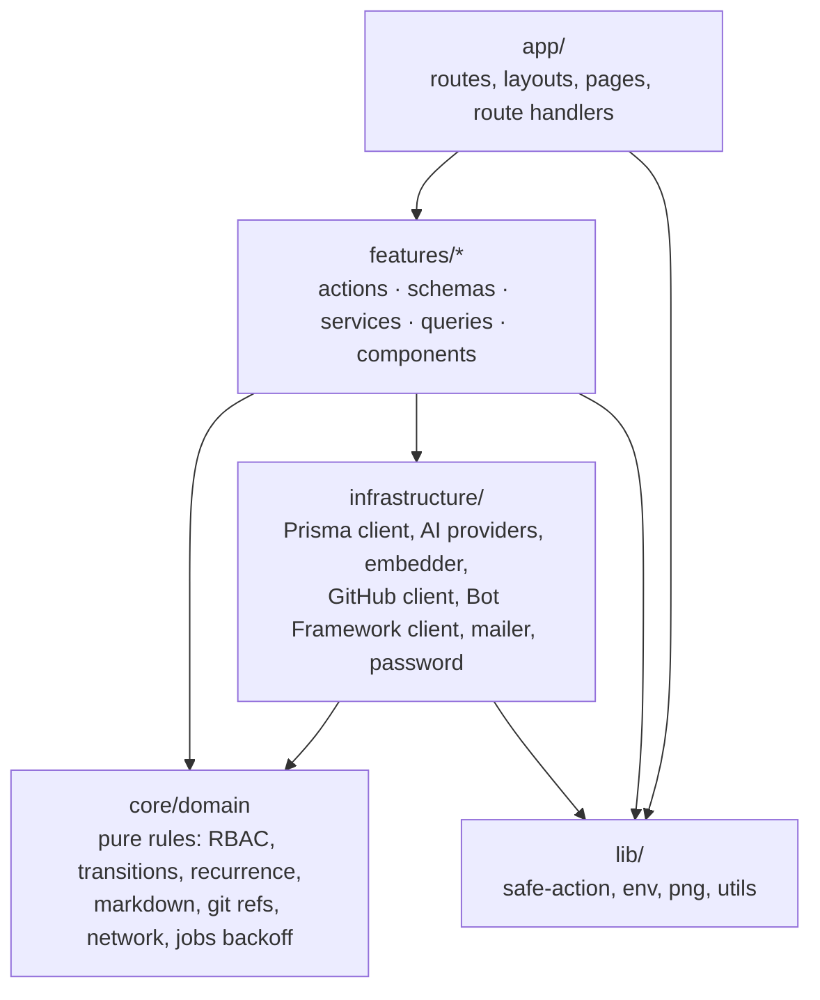
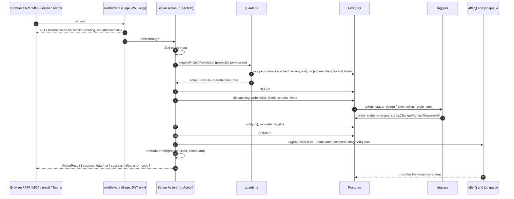

# Architecture

How TaskForge is put together, and why. This describes the code as it is; the
reasons are the ones the code and its migrations record. For the endpoints and
actions themselves, see [API.md](API.md).

## Contents

1. [Shape of the system](#1-shape-of-the-system)
2. [Layering](#2-layering)
3. [Request and mutation flow](#3-request-and-mutation-flow)
4. [Authorization](#authorization)
5. [Acting as a person: email and Teams](#5-acting-as-a-person-email-and-teams)
6. [The trust boundary for AI tools](#6-the-trust-boundary-for-ai-tools)
7. [Database design](#7-database-design)
8. [Background work](#8-background-work)
9. [Integrations](#9-integrations)
10. [Realtime](#10-realtime)
11. [Free-tier constraints](#11-free-tier-constraints)
12. [Security measures](#12-security-measures)
13. [Testing](#13-testing)
14. [Known gaps](#14-known-gaps)

---

## 1. Shape of the system

| Part | Choice |
|---|---|
| Framework | Next.js 15 App Router. Server Components by default; Server Actions for every mutation the UI makes. |
| Database | PostgreSQL (Neon in production), through Prisma 6. Some objects — the search vector, triggers, embeddings — are raw SQL in migrations. |
| Auth | Auth.js with JWT sessions. Credentials (bcrypt) plus optional Keycloak, Google and Microsoft Entra ID. |
| Hosting | Vercel, region `sin1`, next to the database. |
| AI | Groq, Ollama, Anthropic, OpenAI or an OpenAI-compatible endpoint behind one provider port; embeddings in-process (`bge-small-en-v1.5`, 384 dimensions). |
| Scheduling | Vercel Cron once a day; a GitHub Actions workflow every five minutes. |
| Queue | A table in the same Postgres. |

There is one deployable. Nothing runs outside the Next.js process apart from the
two schedulers that call into it and the optional stdio MCP server
(`mcp/server.ts`), which is a client of `/api/mcp`.

---

## 2. Layering

| Layer | Holds | Rule |
|---|---|---|
| `src/core/domain` | Framework-free rules: the permission catalogue and `canInProject`, status requirements, ticket-key and hierarchy rules, recurrence, SLA and flow arithmetic, the Markdown parser, git-ref matching, the Bot Framework claim rules, the SSRF address checks, job backoff | Imports nothing from Next.js, React or the Prisma *client*. It does import Prisma enum **types** (`import type`, erased at compile time), `node:crypto` in `error-events.ts`, and `yaml` in `ci-workflow.ts`. Everything here runs in the domain suite with no database. |
| `src/infrastructure` | Adapters: `db/prisma.ts`, `ai/*` (providers and the embedder), `github/client.ts` and `secrets.ts`, `msteams/client.ts`, `email/mailer.ts`, `auth/password.ts` | Talks to the outside world. No business decisions; it reads `lib/env`, and the Teams client applies the claim rules from `core/domain/msteams`. Nothing here imports a feature. |
| `src/features/<slice>` | One folder per capability: `actions.ts` (`'use server'` entry points), `schemas.ts` (Zod, shared by form and action), `service.ts`, `queries.ts`, `components/` | Features call Prisma directly — there is no repository layer, and `src/core/ports` is empty. Cross-feature calls go through another slice's exported functions. |
| `src/app` | Routing: `(app)` pages, `portal`, `api/*` route handlers | Thin. Pages read through feature queries and guards; route handlers authenticate, then call feature code. |
| `src/lib` | `safe-action.ts` (`runAction`, `toActionError`), `env.ts`, `png.ts`, `utils.ts` | Shared helpers with no feature knowledge. |

`src/middleware.ts` and `src/auth.config.ts` run on the Edge runtime and see only
the JWT; `src/auth.ts` is the Node half, with the database.

---

## 3. Request and mutation flow

Every mutation follows one path: **guard → validate → transact → audit → side
effects → revalidate**. The audit entry (`recordActivity(tx, …)`) is written with
the transaction's client, so a change and its record commit or fail together.

Details that hold across actions:

| Step | Detail |
|---|---|
| Error translation | `runAction` catches everything. Zod, domain errors and the Prisma codes `P2002`, `P2003`, `P2025` become typed failures; anything else is logged and returned as `INTERNAL`. Next.js `redirect()` and `notFound()` are re-thrown. |
| Concurrency | `updateTicketAction` compares `expectedUpdatedAt` and refuses with `CONFLICT` rather than silently overwriting. Ticket numbers come from an atomic increment of `project_settings.nextTicketNumber` inside the caller's transaction. |
| Status rules | A move a person makes into a status with requirements calls `assertCanEnter`, which reads the facts (assignee, estimate, criteria met, linked or merged pull request, custom fields) and refuses with the missing ones. Automation — GitHub moves, parent rollup — does not call it. |
| Side effects | Work that must not delay the response runs in `after()`: urgent-ticket alerts, Teams announcements, the triage agent's enqueue, AI fix runs, and draining the job queue. |
| Reads | Pages read through `features/*/queries.ts`, filtered by `projectVisibilityFilter` or `ticketVisibilityFilter`. Prisma `Decimal` values are converted to `number` in the query layer before anything reaches a Client Component (see [Decimal](#decimal)). |

Pages use `requirePermissionPage` and `requireProjectViewPage`, which redirect to
`/login` or `/forbidden` instead of throwing, because an uncaught
`ForbiddenError` in a page renders a 500. Actions use the throwing variants,
because `runAction` turns the throw into a result the form can show.

---

## 4. Authorization

### The actor

`getCurrentUser()` (`src/features/auth/guards.ts`) resolves, in order:

1. an actor set by `actAs` for the email or Teams channel;
2. the Auth.js session;
3. an `Authorization: Bearer` personal access token.

The session carries only the role **key**. The role's rank and permissions are
read from the database on each request (`resolveRole`, wrapped in React `cache`
so it is one query per request however many guards ask), so an edited or revoked
permission takes effect on the next request rather than when a JWT refreshes. A
missing role resolves to no permissions and the lowest rank. Permission rows the
compile-time catalogue does not contain are dropped.

### Three layers

| Layer | Question | Where |
|---|---|---|
| 1. Capability | Does the role hold the permission at all? | `hasPermission`, `requirePermission` |
| 2. Scope | Is the actor inside this project, with a strong enough project role? | `canInProject`, `requireProjectPermission` |
| 3. Seniority | For actions on other people or roles, does the target rank strictly below the actor? | `outranks`, `features/roles/service.ts` |

Scope, in `canInProject`:

- `project:access-all` waives membership. It grants nothing extra — the role
  still does only what its own permissions allow.
- Otherwise the actor must own the project or have a project role.
- `project:update`, `project:archive`, `project:manage-members`,
  `project:manage-config`, `label:*` and `recurring:manage` need owner or
  `MANAGER`.
- Any `:create`, `:update`, `:delete`, `:transition` or `:assign` needs owner,
  `MANAGER` or `MEMBER`. `VIEWER` is read-only.

`updateTicketAction` adds a fourth, row-level check: without `ticket:update-any`,
and unless the actor manages or owns the project, only tickets assigned to or
reported by the actor may be edited.

### Ranks and seniority

Roles carry a `level`; lower is more senior. The defaults are spaced so custom
roles fit between them.

| Role | Level | Kind |
|---|---|---|
| Admin | 0 | System role, locked — cannot be edited, re-keyed or deleted |
| Project Manager | 20 | System role, editable, not deletable |
| User | 40 | System role, editable, not deletable |
| Client | 80 | Created by migration; portal-only |

Seniority is always *strictly below*: peers cannot act on each other, so two
admins cannot demote one another and nobody edits their own rank. On top of that:

- a role can only be granted by someone who outranks it (`assertCanGrantRole`);
- a new role must rank below its creator, and may hold only permissions its
  creator holds (`assertPermissionsWithinGrant`);
- a delegated team manager (`team:manage-members`) can change only the teams they
  manage, cannot appoint managers, and is still bound by seniority.

### Project access through members and teams

Access to a project arrives by three routes: ownership, direct membership
(`project_members`), and any team attached to the project (`project_teams`) that
the actor belongs to. `getProjectAccess` reads all of them in one query and
`strongestProjectRole` keeps the strongest role (`MANAGER` > `MEMBER` > `VIEWER`),
so being added to a second team can never reduce what someone already had.

### Ticket and project visibility

| Rule | Implementation |
|---|---|
| Listings and search | `projectVisibilityFilter` / `ticketVisibilityFilter`: owned, member, or team-attached projects; `project:view-all` lifts the restriction. |
| Opening a project | `requireProjectView`: `project:access-all` sees everything; a **private** project needs membership even with `project:view-all`; otherwise a non-member needs `project:view-all`. |
| Files | An attachment is exactly as visible as its ticket's project, and an invisible one answers 404. |
| Clients | Middleware sends the `CLIENT` role to `/portal`, `/settings` and `/api` only. That is navigation; the role's four permissions are what limit it. |

### Middleware is not the boundary

`src/middleware.ts` decides routing from the JWT alone: redirect signed-out pages
to `/login`, answer JSON 401 for signed-out `/api/*`, force a pending password
change, keep clients in the portal. Every action and route handler checks again
on the Node side.

### Sessions

The JWT (`maxAge` from `SESSION_MAX_AGE`, default eight hours) is re-checked
against the database every five minutes (`src/auth.ts`). A deleted or
deactivated user, or a `sessionVersion` that no longer matches — bumped by
deactivation, an admin password reset and "end all sessions" — clears the
session. Role, name and forced-change state are refreshed at the same time.

---

## 5. Acting as a person: email and Teams

Email and Teams have no browser session, but the work they carry should be done
by a person, with that person's permissions. `src/features/auth/acting-as.ts`
provides that:

1. The channel authenticates the person its own way. Email requires the sender
   to pass DMARC, or DKIM/SPF for their own domain, and to belong to an active
   account. Teams verifies the Bot Framework JWT and matches the Teams account to
   a TaskForge account by email the first time, then remembers it.
2. `loadActor(userId)` builds an `Actor` from the database — refusing inactive
   accounts and AI agent accounts.
3. `actAs(actor, fn, via)` runs `fn` inside an `AsyncLocalStorage` context.
   `getCurrentUser()` returns that actor for the duration, checked outside the
   per-request cache so a cached session result cannot leak into or out of it.
4. `fn` calls the **same Server Actions** the UI calls — `createTicketAction`,
   `createCommentAction` and so on — so permissions, transactions, notifications
   and audit are those of the person.

The channel adds no authority, and nothing a client sends can choose who is
acted as: `actAs` is only called from server code after the channel's own
verification. `actingVia()` lets a side effect know where the work came from —
`announceTicketLater` uses it so a ticket made in Teams is not echoed back there.

---

## 6. The trust boundary for AI tools

Anything a model emits is untrusted input. The design keeps the model away from
the database entirely.

| Rule | Where |
|---|---|
| One schema per tool, in Zod, is the source of truth; the JSON Schema the model sees is generated from it | `src/features/ai/tools.ts` |
| Arguments are validated before anything runs; a model's explicit `null`s are dropped first so they read as omissions | `executeTool` → `dropNulls` → `safeParse` |
| Numbers are clamped rather than bounded in the schema (Groq rejects a whole request whose arguments fail its own schema check) | `clamp` in `executor.ts` |
| Names become ids only inside what the actor can see: projects through `projectVisibilityFilter`, people through project membership, tickets through visibility | `src/features/ai/resolver.ts` |
| Every write goes through the Server Action the UI uses, so it inherits the guard, transaction and audit | `createTicketAction`, `bulkCreateTicketsAction`, `updateTicketAction`, `createCommentAction` |
| In the Copilot, writes are **proposed**: the permission check runs, nothing changes, and the panel shows an approval card; the person's approval re-runs the call for real | `propose` in `ExecutionContext` |
| There is no delete tool | `TOOL_SCHEMAS` |
| At most four tool rounds per turn | `MAX_TOOL_ROUNDS` in `service.ts` |
| Tool descriptions are kept short because they are re-sent every request; the domain suite fails if the payload exceeds its token budget | `tools.ts`, `scripts/verify-domain.ts` |

The MCP bridge and the REST API call the same `executeTool` with a token's actor,
but without `propose`: for a machine client the call is the approval. The AI
agents (triage, planner, coder, reviewer, release notes, post-mortem) run on
agent accounts that cannot sign in, spend against per-project budgets
(`assertWithinBudget`), and propose rather than merge: AI fixes open pull
requests, the Planner's proposals are applied by a person, and triage can be
undone.

---

## 7. Database design

### Migrations: hand-written, additive half only

Prisma's generated diff is a starting point, not the migration. Prisma does not
know about the objects declared in raw SQL, so on almost every migration it
proposes dropping `tickets_search_idx` and `tickets_key_trgm_idx` and rewriting
the `Unsupported("real[]")` embedding column — the last would discard every
stored vector. Migrations since `20260919080811_configurable_roles_and_teams` are
written from the diff keeping only the additive statements, and each says so in
its header.

CI enforces the part that matters: the *Guard the raw-SQL ticket columns* step
in `.github/workflows/ci.yml` strips SQL comments and fails the build if any
migration contains `DROP INDEX "tickets_search_idx"`,
`DROP INDEX "tickets_key_trgm_idx"` or `DROP COLUMN "embedding"`.

Migrations that change meaning also carry their data: the roles migration
converts the enum column in place and reproduces the old permission matrix as
rows; the status-history migration rebuilds history from the audit log.

### Triggers

History that a dozen code paths would each have to remember is kept by the
database instead.

| Trigger | On | Does |
|---|---|---|
| `tickets_status_before` | `BEFORE INSERT OR UPDATE OF "statusId"` on `tickets` | Sets `statusChangedAt` (creation time on insert, now in UTC on change); sets `firstResponseAt` the first time the ticket moves to a category other than `BACKLOG` or `TODO` |
| `tickets_status_after` | `AFTER INSERT OR UPDATE OF "statusId"` on `tickets` | Inserts a `ticket_status_changes` row with from/to status ids and a **snapshot** of from/to categories, so re-categorising a status later does not rewrite the past |
| `comments_first_response` | `AFTER INSERT` on `comments` | Sets `firstResponseAt` on the first comment by someone other than the reporter who is not an agent |
| `tickets_cycle_after` | `AFTER INSERT OR UPDATE OF "cycleId"` on `tickets` | Inserts a `ticket_cycle_changes` row, which is what burn-up and scope-change reports read |

Timestamps are written in UTC, as Prisma writes them. `ticket_status_changes` is
also the source of outbound webhook events, so no write path can forget to emit
one.

### Search: a generated tsvector

`tickets."searchVector"` is a `GENERATED ALWAYS AS … STORED` column weighting
title (A), description (B) and remarks (C), with a GIN index. Being generated, it
cannot fall out of step with the row and no application code maintains it. A
`pg_trgm` GIN index on `key` serves partial keys like `ATLAS-1`, which the
tokeniser treats as one lexeme.

### Embeddings as `real[]`

Ticket and project-memory embeddings are `real[]` columns, not pgvector. pgvector
is not in a stock Postgres image, and requiring it would break CI and every fresh
clone for an index that only pays off well past the scale here, because
similarity is always evaluated inside one project. Scoring happens in SQL — the
dot product of two L2-normalised vectors over `unnest`, which is the cosine — so
vectors never cross the network. An `embeddingHash` (md5 of the source text)
beside each vector lets the daily sweep find stale rows without any write path
having to invalidate them; a partial index finds the ones never embedded.

### Decimal

`estimateHours` (`NUMERIC(6,2)`) and the project hourly rate are Postgres
`NUMERIC`, which Prisma returns as `Decimal` objects. React cannot serialise a
class instance across the Server → Client boundary, so conversion to `number`
happens once in the query layer (`toSerializable` in `tickets/queries.ts`, and
`getProjectDetail` in `projects/queries.ts`) rather than in each view. `NUMERIC(6,2)`
fits a double without loss; a wider column would need a string. Domain code
that reads these values converts with `Number()` as well (for example
`transitionFacts`).

### Other choices

| Choice | Why |
|---|---|
| Attachment and avatar bytes in their own tables (`ticket_attachment_data`, `user_avatar_images`) | Prisma selects every scalar unless told otherwise; a separate table makes reading megabytes by accident impossible rather than discouraged. |
| Bytes in Postgres at all | No paid object store (see [free tier](#11-free-tier-constraints)); attachments are capped at 5 MB each and 20 per ticket. |
| Per-project workflow tables | Statuses, priorities, types and labels belong to a project, so boards differ without nullable foreign keys. |
| Status categories | Automation targets a category (`IN_PROGRESS`, `REVIEW`, `DONE`), never a status id, so renaming or reordering columns breaks nothing. |
| Secrets sealed in rows | Integration credentials are AES-256-GCM sealed (see [security](#12-security-measures)). |

---

## 8. Background work

Three mechanisms, from nearest to furthest from the request.

### `after()`

Next.js `after()` runs a callback once the response has been sent, inside the
same function invocation. It is used for work the person should not wait for:
the Teams announcement, urgent-ticket alerts, queueing triage, AI fix runs
(which take from twenty seconds to minutes; the ticket page polls the run row),
handling a Teams activity after acknowledging it, and draining the job queue.
Each call is wrapped so that outside a request — the seed, a script — it is a
no-op rather than an error.

### The Postgres job queue

`src/features/jobs/queue.ts`, over the `jobs` table.

| Property | Detail |
|---|---|
| Kinds | `webhook.deliver`, `triage.ticket`, `memory.index`, `handbook.generate` |
| Enqueue | Inserts a row; a `dedupeKey` collision (`P2002`) means the job is already queued and is ignored. By default schedules a drain in `after()`. |
| Claim | `UPDATE … WHERE id IN (SELECT … FOR UPDATE SKIP LOCKED) RETURNING`, so concurrent drains never take the same job. |
| Retry | Backoff of 1 min, 5 min, 30 min, 2 h, 6 h (`core/domain/jobs.ts`); then `FAILED` until retried from the integrations page. |
| Crash recovery | A job `RUNNING` for more than ten minutes is handed back to `PENDING`. |
| Time budget | A drain stops starting jobs past its budget and hands the rest back untouched. |
| Housekeeping | `DONE` jobs are deleted after a week. |

### Crons

| Schedule | Driver | Route | Work |
|---|---|---|---|
| Daily, 06:00 UTC | Vercel Cron (`vercel.json`) | `/api/cron/recurring` | Recurring tickets, embedding sweep, GitHub reconciliation, daily digests, memory indexing; on Mondays prices, AI usage report, manager digests, handbooks; job drain |
| Every 5 minutes | GitHub Actions (`.github/workflows/uptime.yml`) | `/api/cron/monitors` | Uptime monitors, SLA alerts, inbound mailbox, webhook outbox, job drain |

The five-minute schedule lives in GitHub Actions because Vercel's hobby plan
runs cron at most daily. Both routes are safe to call more often than scheduled:
monitors run only when their own interval has elapsed and recurring schedules
only when `nextRunAt` has passed.

---

## 9. Integrations

All integrations are plain HTTPS in one file each, with no vendor SDK.

| Integration | Shape |
|---|---|
| **GitHub App** (`infrastructure/github/client.ts`, ~230 lines, no Octokit) | Created from a manifest, so no key is ever pasted. Two credentials: an RS256 app JWT signed with `node:crypto` (backdated a minute, nine minutes of life) and one-hour installation tokens, cached per process until five minutes before expiry. Webhooks are verified by HMAC over the raw body in constant time. Credentials come from `GITHUB_APP_ID`, `GITHUB_APP_PRIVATE_KEY` and `GITHUB_WEBHOOK_SECRET` when all three are set, otherwise from the sealed row the manifest flow wrote. Webhooks and reconciliation (the daily cron, the Sync button, linking a repository) feed the same idempotent upsert, so a missed or repeated delivery converges. The manifest asks for `contents` and `pull_requests` write (AI fixes push branches and open pull requests) and read on metadata, checks, deployments and actions. People connect their own GitHub accounts separately for actions taken as them, such as creating a repository. |
| **Microsoft Teams bot** (`infrastructure/msteams/client.ts`, no Bot Framework SDK) | Incoming JWTs are verified against Bot Framework's published keys (RS256 only, key id refetched once when unknown, channel endorsement) and then the claim rules in `core/domain/msteams.ts`. Outgoing calls get a token from `login.microsoftonline.com` and are sent only to allowed Bot Connector hosts. Credentials are checked with Microsoft before they are saved. The app package is zipped in code. |
| **Email** (`infrastructure/email/mailer.ts`, `features/inbound-email`) | SMTP out; IMAP in, polled by the five-minute cron, reading only unseen mail to plus addresses (`mailbox+demo@`, `mailbox+demo-12@`). |
| **Sentry / any app** | `POST /api/ingest/errors/<secret>`; errors are grouped by a masked fingerprint and become tickets. |
| **Vercel** | A stored token for deployment rollback. |
| **SSO** (`features/sso/providers.ts`) | Keycloak, Google and Microsoft Entra ID via Auth.js, enabled by env vars. A sign-in is admitted only for a verified email that matches an existing, active, human account; nothing is provisioned. |
| **Outbound webhooks** | See [API.md §3](API.md#3-outbound-webhooks). |

---

## 10. Realtime

There are no WebSockets or server-sent events. Serverless functions are billed
for every second a connection stays open, and the free tier counts invocations.

| Surface | Mechanism |
|---|---|
| Board and table | `LiveRefresher` polls `/api/live?project=…` every 20 seconds, only while the tab is visible and only for projects with live updates switched on. The answer is one string — ticket count, latest ticket `updatedAt`, latest comment `createdAt` — from two aggregates. When it changes, the page calls `router.refresh()`. |
| Notifications | The header bell polls `fetchNotificationsAction` every 60 seconds. |
| Your own changes | `revalidatePath` in the action refreshes the views the change touches. |
| AI fix runs | The ticket page polls the run row. |

---

## 11. Free-tier constraints

The product is designed to run on free tiers with no paid service.

| Constraint | Design response |
|---|---|
| Vercel hobby: cron at most daily | Daily work on Vercel Cron; five-minute work on a GitHub Actions schedule calling a secret-guarded route |
| Vercel: billed per invocation and duration | Version polling instead of held connections, opt-in per project; `after()` rather than a worker; job drains bounded by a time budget; `maxDuration` set per route |
| No paid queue | Jobs in Postgres with `SKIP LOCKED` |
| No object storage | Attachments and avatars in Postgres, size-capped |
| Neon: small database | Finished jobs pruned after a week; project memory capped at 3,000 chunks per project; embeddings as `real[]` in the same database |
| No vector database or pgvector | `real[]` and in-SQL dot products, always inside one project |
| Groq free tier: 8,000 tokens per minute | Terse tool descriptions under a tested token budget; deterministic features (duplicate suggestions, triage suggestions, slash commands) make no model call; Whisper transcription is on a separate quota |
| No paid embedding API | `bge-small-en-v1.5` in-process via `@xenova/transformers`, about 33 MB, loaded once per process and swept daily rather than on save |
| Cross-region latency | Functions pinned to `sin1`, next to the database |

---

## 12. Security measures

| Measure | Detail |
|---|---|
| Passwords | bcrypt. A missing user, an agent account, a malformed request and a locked account all spend the same hashing time (`fakeVerify`), so timing does not reveal which. |
| Lockout | Per account, not per IP (an office shares one address). After 8 failures, 15 minutes, doubling with each further failure, capped at four hours. It expires on its own, so it cannot be used to lock a colleague out indefinitely. Success resets the count. |
| JWT revalidation | Every five minutes against the database; deactivation, `sessionVersion` bumps and deletion end sessions. Permissions are never read from the token. |
| Forced password change | Middleware blocks everything but the change screen while `mustChangePassword` is set. |
| Personal access tokens | 32 random bytes; SHA-256 stored; constant-time compare; revoked, expired and unknown tokens are indistinguishable; deactivating a user stops their tokens. |
| Sealed secrets | The GitHub App key and webhook secret, people's GitHub tokens, the Teams client secret, AI provider keys, the Vercel token and outbound webhook secrets are AES-256-GCM sealed with a key derived from `AUTH_SECRET` under a domain-separation label. A database dump alone yields nothing usable; rotating `AUTH_SECRET` means reconnecting. |
| Signed webhooks in | GitHub: HMAC-SHA256 over the raw body, constant time, before parsing. Teams: full Bot Framework JWT verification, and replies only to Microsoft hosts so a forged activity cannot collect the bot's token. Error intake: a hashed per-project secret. Crons: `CRON_SECRET`, constant time. |
| Signed webhooks out | `X-TaskForge-Signature: sha256=…` under a per-webhook secret shown once. |
| SSRF | Monitor and webhook URLs must be http(s), carry no credentials, and not name `localhost`, `.local`, `.internal` or a private, link-local, CGNAT, multicast or reserved address (`core/domain/network.ts`). Webhook delivery re-resolves the host and refuses if any address is private, and does not follow redirects. |
| OAuth state | GitHub manifest and user-connect flows set a random `state` in an httpOnly cookie scoped to the callback path and refuse a callback without it. |
| Markdown without HTML | `core/domain/markdown.ts` parses a subset into a tree and `RichText` renders React nodes. There is no HTML step and no `dangerouslySetInnerHTML`, so safety does not depend on a Content Security Policy; links are restricted to `http(s)`, `mailto` and in-app paths at parse time. |
| Serving uploads | Every download authorised; invisible files are 404; SVG and unknown types are never rendered inline; filenames sanitised for `Content-Disposition`; `nosniff`, a sandboxing CSP and private caching on each response. Avatars are re-sniffed on the way out. |
| Headers | `X-Content-Type-Options: nosniff`, `X-Frame-Options: DENY`, `Referrer-Policy: strict-origin-when-cross-origin`, a restrictive `Permissions-Policy`, no `X-Powered-By` (`next.config.ts`). |
| Error hygiene | `runAction` never returns a stack trace or Prisma message; the REST API and MCP bridge return generic messages for unexpected errors. |
| Audit | Mutations write `activity_logs` in their own transaction; integrations, AI settings and GitHub automation changes are audited too. |

---

## 13. Testing

| Suite | Command | Covers | Needs |
|---|---|---|---|
| Domain | `npm run verify` (`scripts/verify-domain.ts`) | The pure layer: permission catalogue, `canInProject`, seniority, strongest-role, rollup, hierarchy, recurrence, ticket keys, tool schemas and their token budget, null handling, clamping, slash parsing, Markdown edge cases, attachment serving rules, CSV escaping, Bot Framework token checks with self-signed tokens, SSRF address checks, and more | nothing — no database, no network, under a second |
| Embeddings | `npm run verify:embeddings` | Semantic similarity against a real database and the real model | Postgres |
| Smoke | `npm run smoke` | Signs in, walks every route, and greps the server log for errors that still return 200 | a database |
| Browser | `npm run e2e` (Playwright, Chrome) | Page-level scroll containment across viewports from phone to desktop, the forced password-change gate, the notification chime, role privilege-escalation guards, project access following a team being attached and detached | a browser and a seeded database |
| AI evals | `npm run eval:ai` (`evals/`) | Routing, extraction, grounding and safety of the Copilot against the live model, using the app's real prompt builder and tool definitions; stops at the tool call, so nothing executes | an API key |

CI (`.github/workflows/ci.yml`) runs the migration guard, lint, typecheck, the
domain suite and a production build with no environment variables, then — against
a real `postgres:16` service, because the schema needs a generated tsvector and
`pg_trgm` — applies migrations, seeds demo data, runs the embeddings check and the
browser suite.

---

## 14. Known gaps

Things the code does not do, or does in a way a reader should know about.

| Gap | Detail |
|---|---|
| API permission failures read as 422 | Refusals inside a Server Action come back as `{ ok: false, message }` with 422, not 403; only guards outside actions produce their own status. |
| API status changes skip `ticket:transition` | Changing status through `updateTicketAction` (API, Copilot, ticket sidebar) needs `ticket:update`; only the board's drag (`moveTicketAction`) checks `ticket:transition`. |
| Bearer tokens only reach `/api/v1` and `/api/mcp` | Middleware answers 401 for any other signed-out `/api/*` path and redirects page POSTs, so the token fallback in `getCurrentUser` is reachable only through those two routes. |
| Webhook latency and replay | Events wait for the five-minute sweep. There is no timestamp header or delivery id; `deliveredAt` is inside the signed body. The DNS check at delivery is separate from the connection's own resolution, so a host that changes its answer between the two is not caught. |
| No API rate limiting or pagination | The REST API and MCP bridge have no request limits; search returns at most 50 rows. |
| `after()` is bounded by the function | Work in `after()` shares the invocation's `maxDuration`. The ticket page raises it to 300 seconds for AI fix runs; a run that outlives that is cut off. The job queue has stale-lock recovery; `after()` work does not. |
| Live updates see the ticket row | The live version reads ticket count, latest ticket `updatedAt` and latest comment. A change that touches only a related table without updating the ticket row does not move it. |
| `core/ports` is empty | The layering has a place for repository interfaces, but features call Prisma directly. |
| Single region, single database | No read replicas or failover; the design assumes one Postgres. |
