# TaskForge — Entity Relationship Model

The database is PostgreSQL (Neon in production), described by
[`prisma/schema.prisma`](../prisma/schema.prisma): **79 models and 26 enums**,
built up by 39 migrations in [`prisma/migrations`](../prisma/migrations). This
document groups the models by domain, draws the relations that matter, and
records what the schema file cannot show: the objects created in raw SQL
(generated columns, trigram and partial indexes, triggers), the referential
actions, and which index serves which hot query.

## Contents

1. [Conventions](#1-conventions)
2. [Map of the domains](#2-map-of-the-domains)
3. [Identity and access](#3-identity-and-access)
4. [Projects and workflow](#4-projects-and-workflow)
5. [Tickets and collaboration](#5-tickets-and-collaboration)
6. [Planning, flow and time](#6-planning-flow-and-time)
7. [Custom fields](#7-custom-fields)
8. [GitHub and delivery](#8-github-and-delivery)
9. [Production: errors and monitors](#9-production-errors-and-monitors)
10. [AI: engines, usage, budgets, fix runs, agents](#10-ai-engines-usage-budgets-fix-runs-agents)
11. [Knowledge: memory and documents](#11-knowledge-memory-and-documents)
12. [Channels: email in and Microsoft Teams](#12-channels-email-in-and-microsoft-teams)
13. [Platform: jobs, webhooks, secrets](#13-platform-jobs-webhooks-secrets)
14. [Enums](#14-enums)
15. [Objects created in raw SQL](#15-objects-created-in-raw-sql)
16. [Unique constraints](#16-unique-constraints)
17. [Cascade rules](#17-cascade-rules)
18. [Index coverage for hot queries](#18-index-coverage-for-hot-queries)
19. [Normalisation notes and deliberate exceptions](#19-normalisation-notes-and-deliberate-exceptions)

---

## 1. Conventions

| Convention | Detail |
|---|---|
| Primary keys | `cuid()` text ids. History tables written by triggers use `gen_random_uuid()::text`, because a trigger cannot call Prisma's cuid. |
| Singleton rows | `GithubApp`, `AiWorkspaceSetting`, `InboundEmailSetting` and `OutboxCursor` have `id Int @default(1)`: exactly one row. |
| Keyed settings | `AiEngineSetting` (by provider), `AgentSetting` (by agent), `IntegrationSecret` (by key, e.g. `vercel`, `msteams`) use a natural text key. |
| Table names | Every model is `@@map`ped to a snake_case plural table (`Ticket` → `tickets`). Column names keep Prisma's camelCase, so raw SQL quotes them: `"projectId"`. |
| Foreign keys | Every relation declares `onDelete` explicitly. See [section 17](#17-cascade-rules). |
| Plain-id references | A few columns hold an id without a foreign key, on purpose: the row must survive the thing it points at. `ActivityLog.entityId`, `TicketStatusChange.fromStatusId/toStatusId`, `TicketCycleChange.*CycleId`, `AiUsageEvent.ticketKey`, `Monitor.incidentTicketId`, `AiFixRun.planRunId/batchId`, `OutboundWebhook.createdById`, `MsTeamsMessage.userId`, `ProjectDocumentRead.*`. |
| Sealed columns | Columns ending `Enc` are AES-256-GCM ciphertexts keyed from `AUTH_SECRET` ([`infrastructure/github/secrets.ts`](../src/infrastructure/github/secrets.ts)). Changing `AUTH_SECRET` makes them unreadable; see [OPERATIONS.md](OPERATIONS.md#rotating-secrets). |
| Hashed columns | `AccessToken.tokenHash` and `ProjectSettings.errorIngestHash` are SHA-256 digests. The plaintext is shown once and never stored. |
| Money | Prices and limits are `Decimal`; recorded spend is `BigInt` micro-dollars (`costMicros`), snapshotted at call time. |
| Unsupported columns | `tickets.searchVector` (`tsvector`), `tickets.embedding` and `memory_chunks.embedding` (`real[]`) are declared `Unsupported(...)` and only read or written in raw SQL. |

## 2. Map of the domains

A bird's-eye view: which domain hangs off which. Each box is expanded in its own
section below.

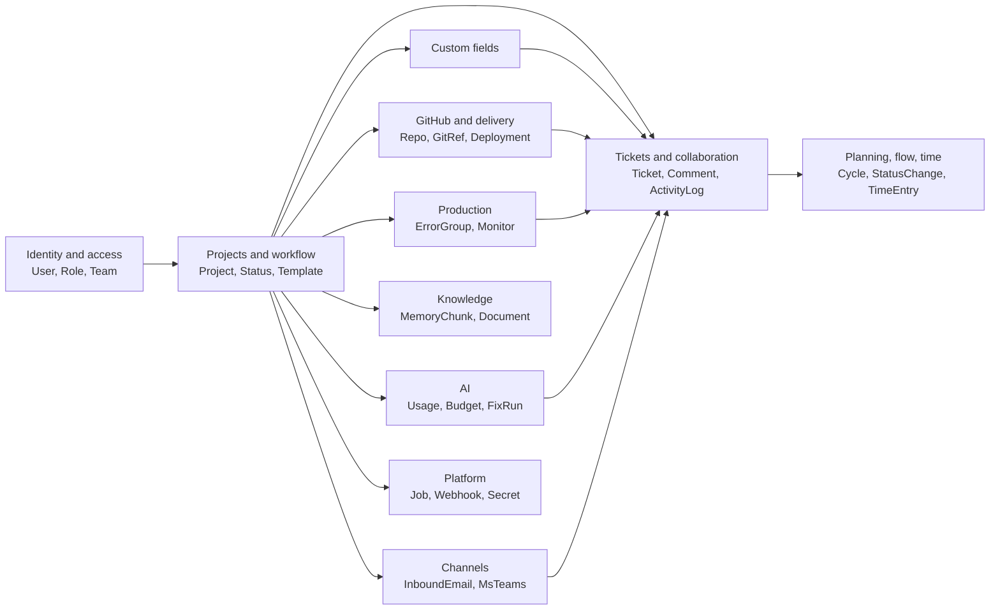

`Project` and `Ticket` are the two hubs. Almost everything project-scoped cascades
from `Project`; almost everything ticket-scoped cascades from `Ticket`.

---

## 3. Identity and access

| Model | Table | Purpose |
|---|---|---|
| `Role` | `roles` | An administrator-defined role. `key` is free text (it was an enum until the roles migration); `level` ranks authority, lower being more senior (Admin 0, Project Manager 20, User 40, Client below staff); `isSystem` roles cannot be deleted or re-keyed; `color` is the avatar rim. |
| `RolePermission` | `role_permissions` | One granted permission string. The catalogue itself lives in [`core/domain/rbac.ts`](../src/core/domain/rbac.ts); only the mapping is data. |
| `User` | `users` | An account. `sessionVersion` is bumped to revoke every JWT; `failedLoginAttempts` / `lockedUntil` drive lockout; `isAgent` marks the AI agent accounts (Coder, Planner, Reviewer, Release Manager, Triage, Ops), which can never sign in. |
| `Team` | `teams` | A group of people with managers, used to scope delegated administration and to staff projects. |
| `TeamMember` | `team_members` | Membership, with `isManager`. Composite key `(teamId, userId)`. |
| `AccessToken` | `access_tokens` | A personal access token for the MCP server, the REST API and scripts. Only the SHA-256 is kept. |
| `UserSession` | `user_sessions` | A sign-in record: IP, user agent, last seen, revoked. The session itself is a stateless JWT. |
| `UserAvatarImage` | `user_avatar_images` | The profile photo bytes (max 256 KB), apart from `users` so loading a user never loads an image. |

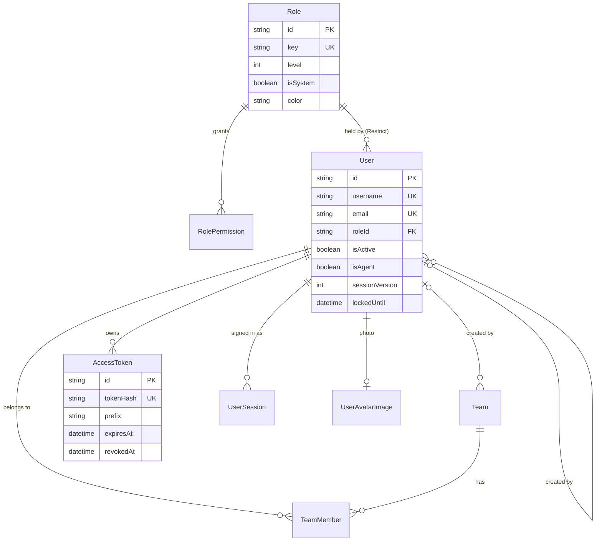

`Notification` belongs to people too, but is drawn with tickets in
[section 5](#5-tickets-and-collaboration). `GithubUserToken` is in
[section 8](#8-github-and-delivery) and `MsTeamsUser` in
[section 12](#12-channels-email-in-and-microsoft-teams).

---

## 4. Projects and workflow

| Model | Table | Purpose |
|---|---|---|
| `ProjectTemplate` | `project_templates` | A workspace blueprint of statuses, priorities, types, labels and starter tickets. `isDefault` picks the one used when none is chosen. |
| `TemplateStatus` / `TemplatePriority` / `TemplateTicketType` / `TemplateLabel` | `template_*` | The template's workflow configuration, cloned into a project at creation. |
| `TemplateTicket` | `template_tickets` | A starter ticket; self-referencing so a template can ship a parent with children. Type, priority and labels are resolved **by name** against the cloned project. |
| `TemplateTicketLabel` | `template_ticket_labels` | Label names on a starter ticket. |
| `Project` | `projects` | `code` is the unique ticket prefix (`AUTH` → `AUTH-14`). |
| `ProjectSettings` | `project_settings` | One-to-one configuration, split from `Project` so listing projects never loads it. Holds the ticket counter (`nextTicketNumber`), appearance, `defaultView`, and every per-project switch. |
| `ProjectMember` | `project_members` | A direct member with a `ProjectMemberRole`. |
| `ProjectTeam` | `project_teams` | A team attached to a project; everyone in it gains the given role. Unioned with direct members, strongest role wins. |
| `Status` | `statuses` | A board column: `category` (`StatusCategory`), `position`, `isInitial`, soft `wipLimit`, and `requirements` (entry rules such as `ASSIGNEE`, `MERGED_PR`, `FIELD:<id>`). |
| `Priority` | `priorities` | `level` orders urgency; `respondWithinHours` / `resolveWithinHours` are the service targets. |
| `TicketType` | `ticket_types` | Display name plus a fixed `kind` (`TicketKind`), a description template and a checklist template. |
| `Label` | `labels` | Project-scoped labels. |
| `RecurringTicket` | `recurring_tickets` | A schedule that materialises tickets (`frequency`, `interval`, `dayOfWeek`, `dayOfMonth`, `nextRunAt`). |
| `RecurringTicketLabel` | `recurring_ticket_labels` | Labels applied to generated tickets. |
| `SavedFilter` | `saved_filters` | A named, optionally shared or pinned view. |
| `SavedFilterCriterion` | `saved_filter_criteria` | One `field operator value` row; multi-value operators write one row per value. |

`ProjectSettings` switches, for reference:

| Column | Default | Meaning |
|---|---|---|
| `defaultView` | `insights` | The view `/projects/<id>` redirects to: one of `LANDING_VIEWS` in [`features/projects/views.ts`](../src/features/projects/views.ts). Added by `20261004000000_project_default_view`. |
| `autoStatusRollup` | true | A parent's status follows its children. |
| `allowSubtasks` / `requireDueDate` / `isPrivate` | true / false / false | Hierarchy, due-date rule, visibility. |
| `githubAutomation` | true | Pull requests move tickets forward. |
| `aiWorkflows` / `aiAutoHeal` / `aiDraftUntilGreen` / `aiAutoMerge` | false | "Fix with AI" autonomy switches; `autoMergeMaxLines` (40) and `autoMergeKinds` (`TASK,ENHANCEMENT`) bound auto-merge. |
| `errorIngestHash` | null | SHA-256 of the project's error-ingest token. Unique. |
| `stuckAfterDays` | 5 | Stuck flag threshold; null turns it off. |
| `slaKinds` | `PRODUCTION,BUG` | Ticket kinds the priorities' targets apply to. |
| `hourlyRate` / `currency` | null / `USD` | Billing for the client report. |
| `emailIntake` | false | Email to `mailbox+code@` becomes tickets. |
| `memoryEnabled` / `handbookAutoRefresh` | true / false | Project memory; Monday handbook refresh. |
| `triageAgent` / `dailyDigest` / `liveUpdates` | false | Opt-in automations. |
| `defaultAssigneeId` | null | FK to `User`, `SetNull`. |

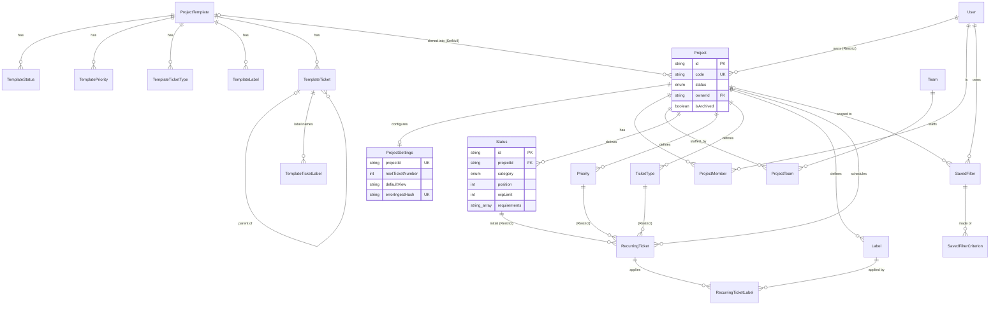

---

## 5. Tickets and collaboration

| Model | Table | Purpose |
|---|---|---|
| `Ticket` | `tickets` | The work item. `number` is per project; `key` (`AUTH-14`) is a deliberate denormalisation, unique platform-wide. Two levels of hierarchy via `parentId` (the depth rule is in the domain layer). Carries `position` (Kanban), `backlogRank`, `cycleId`, `externalRef` (import), `statusChangedAt` and `firstResponseAt` (trigger-kept), `searchVector`, `embedding`, `embeddingHash`. |
| `TicketLabel` | `ticket_labels` | Explicit join, with its own timestamp. |
| `TicketLink` | `ticket_links` | `BLOCKS`, `RELATES_TO`, `DUPLICATES`, stored once per pair; the reverse reading is derived. |
| `TicketWatcher` | `ticket_watchers` | Following a ticket without being assigned. |
| `TicketAttachment` | `ticket_attachments` | File metadata (name, type, size). |
| `TicketAttachmentData` | `ticket_attachment_data` | The bytes (`bytea`), one-to-one, in their own table so no list query can load a blob by accident. Max 5 MB each, 20 per ticket. |
| `TicketResource` | `ticket_resources` | An external link (GitHub, Figma, SharePoint…). |
| `TicketChecklistItem` | `ticket_checklist_items` | An acceptance criterion, with who ticked it and when. |
| `Comment` | `comments` | Threaded via `parentId`; soft-deleted via `deletedAt` so threads keep their shape. |
| `CommentMention` | `comment_mentions` | Who a comment @mentions. |
| `Notification` | `notifications` | The in-app inbox; `title`/`body` rendered at write time. |
| `ActivityLog` | `activity_logs` | The append-only audit timeline. Field-level diffs as columns (`field`, `oldValue`, `newValue`), `entityLabel` snapshotted. |
| `BulkOperation` | `bulk_operations` | A bulk edit remembered for undo: each ticket's prior values and its `updatedAt` straight after. |
| `TriageRun` | `triage_runs` | What TaskForge Triage changed on a ticket, for undo. |

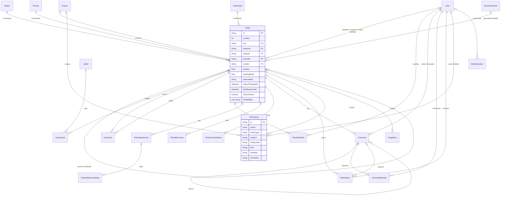

---

## 6. Planning, flow and time

| Model | Table | Purpose |
|---|---|---|
| `Cycle` | `cycles` | A sprint (`SPRINT`, one active per project) or milestone (`MILESTONE`, several at once), with `state`, dates, `capacity` and a closing `summary` (JSON). |
| `TicketCycleChange` | `ticket_cycle_changes` | Every move into or out of a cycle. **Written only by a trigger.** Feeds the burn-up's scope line. |
| `TicketStatusChange` | `ticket_status_changes` | Every status change, with the categories snapshotted. **Written only by a trigger.** Feeds time in status, forecasts, DORA, SLA clocks and outbound webhooks. |
| `TicketSlaAlert` | `ticket_sla_alerts` | An SLA alert already sent (`respond:warn`, `resolve:breach`…), so each is sent once. |
| `TimeEntry` | `time_entries` | A running timer (`endedAt` null), a stopped one, or a manual entry. `userId` is `SetNull` so billed hours survive an account's removal. |

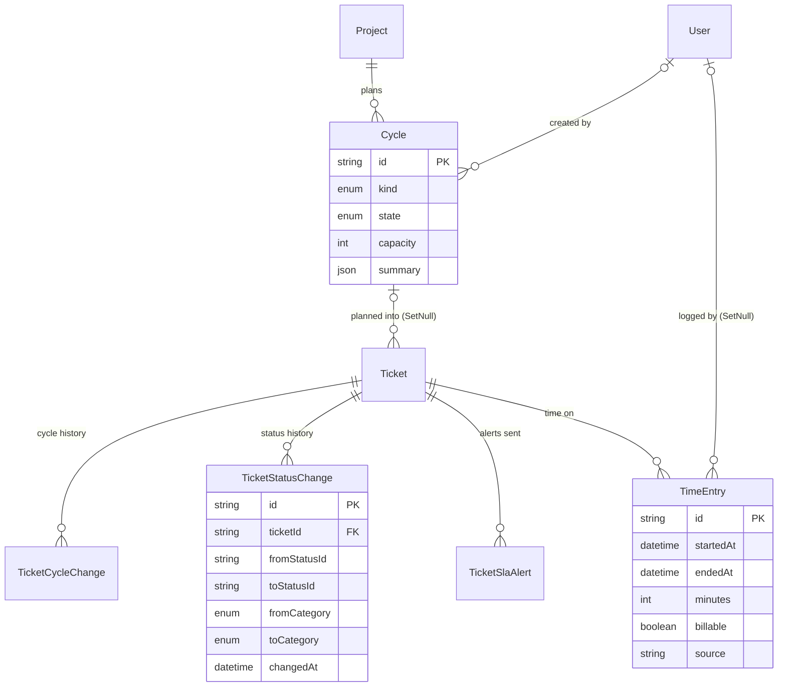

---

## 7. Custom fields

| Model | Table | Purpose |
|---|---|---|
| `CustomField` | `custom_fields` | A field a project adds: `type` (`CustomFieldType`), `options` for selects, `required` at creation, `position`. |
| `TicketFieldValue` | `ticket_field_values` | One ticket's value for one field, normalised to text (numbers as numbers, dates `YYYY-MM-DD`, multi-select as a JSON array, checkbox `"true"`). Composite key `(ticketId, fieldId)`. |

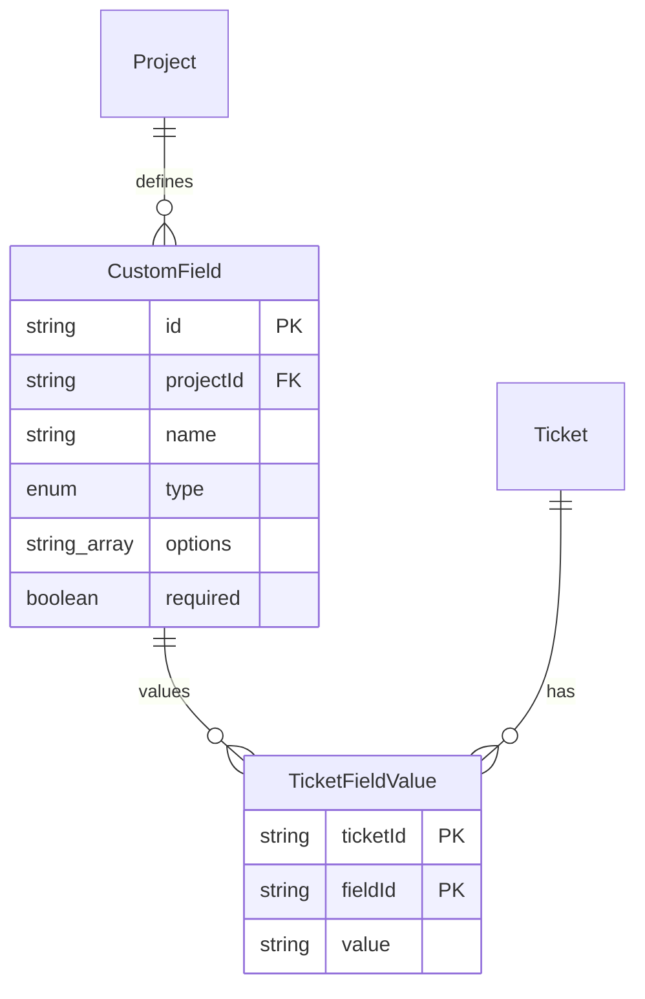

A status requirement of `FIELD:<id>` refers to a `CustomField` by id inside
`Status.requirements`; it is not a foreign key, so deleting a field leaves a rule
the domain layer ignores.

---

## 8. GitHub and delivery

| Model | Table | Purpose |
|---|---|---|
| `GithubApp` | `github_apps` | The workspace's own GitHub App (singleton), created by the manifest flow. Secrets sealed. Environment variables take precedence over this row. |
| `GithubInstallation` | `github_installations` | One install on a user or organisation. `installationId` is a `BigInt`. `removedAt` marks an uninstall without deleting history. |
| `GithubRepo` | `github_repos` | A mirrored repository. `isAccessible` goes false when a grant is withdrawn; rows are never deleted for that. |
| `ProjectRepo` | `project_repos` | Many-to-many: which repositories a project's work lands in, with an optional `role`. |
| `TicketGitRef` | `ticket_git_refs` | A branch, pull request or commit that mentions a ticket key, with state, CI result, head and merge commit, and the Reviewer's verdict. One idempotent upsert fed by webhook and reconciliation. |
| `Deployment` | `deployments` | A deployment reported to GitHub (Vercel, Netlify, a workflow), `isProduction`, `state`, preview `url`. |
| `TicketDeployment` | `ticket_deployments` | Which tickets a deployment shipped. |
| `GithubUserToken` | `github_user_tokens` | A person's own GitHub authorisation (sealed), used only to create repositories under a personal account. |

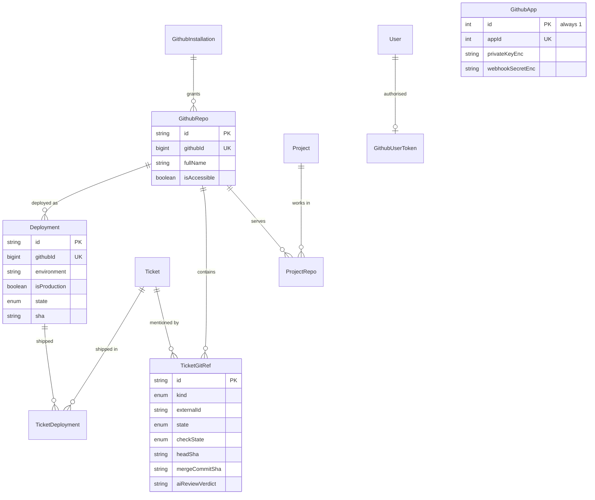

---

## 9. Production: errors and monitors

| Model | Table | Purpose |
|---|---|---|
| `ErrorGroup` | `error_groups` | One distinct production error, grouped by `fingerprint` (type and message with volatile parts masked, plus the top frame), with `count`, first and last seen, and the ticket it was filed into. |
| `Monitor` | `monitors` | An uptime check on a URL: expected status, optional keyword, interval, failure threshold, current `state`, `consecutiveFailures`, `downSince`, and the open incident ticket. |
| `MonitorCheck` | `monitor_checks` | One check result. **Pruned after seven days** by the five-minute cron. |

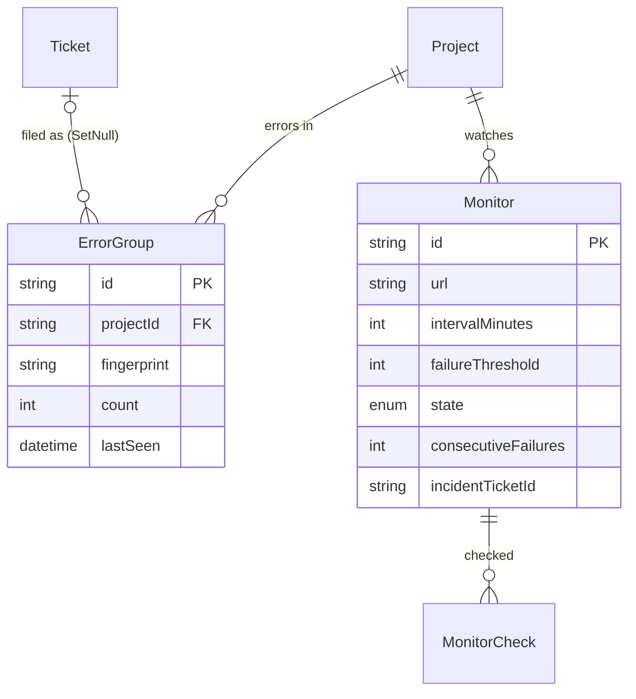

`Monitor.incidentTicketId` is a plain id, not a relation: an incident ticket can
be archived or deleted without touching the monitor.

---

## 10. AI: engines, usage, budgets, fix runs, agents

| Model | Table | Purpose |
|---|---|---|
| `AiEngineSetting` | `ai_engine_settings` | Per provider (`anthropic`, `openai`, `groq`, custom): chosen model, sealed API key and its last four characters, `billingPlan` (`free`, `list`, `custom`), `baseUrl` for the custom OpenAI-compatible engine. |
| `AiWorkspaceSetting` | `ai_workspace_settings` | Singleton: which engine the Copilot and "Fix with AI" use by default. |
| `AiModelPrice` | `ai_model_prices` | Price per million tokens, list and custom, with `source` (`auto` from the public catalogue, or `manual`) and capability facts. Key `(provider, model)`. |
| `AiUsageEvent` | `ai_usage_events` | The ledger: one row per model call, with `feature` (`AiFeature`), tokens, `costMicros` and `listCostMicros`. `projectId` and `userId` are `SetNull`, so spend outlives what it was spent on. |
| `AiBudget` | `ai_budgets` | A monthly limit per workspace, project or provider; warns at 80% and 100%, blocks only with `hardStop`. `lastAlert` records the highest threshold announced this month. |
| `ReportSubscription` | `report_subscriptions` | Who receives the weekly usage report or budget alerts: a user or a whole team. |
| `AiFixRun` | `ai_fix_runs` | One "Fix with AI" attempt: `mode` (`FIX`, `PLAN`, `HEAL_CI`, `SCAFFOLD`), `status`, branch and pull request, transcript, tokens. |
| `AgentSetting` | `agent_settings` | Which engine and model one agent (`copilot`, `coder`, `planner`, `reviewer`, `release`, `ops`) uses. |

The agents themselves are ordinary `User` rows with `isAgent = true` and the
`AI_AGENT` role, so they author comments and appear in history and usage like
anyone else.

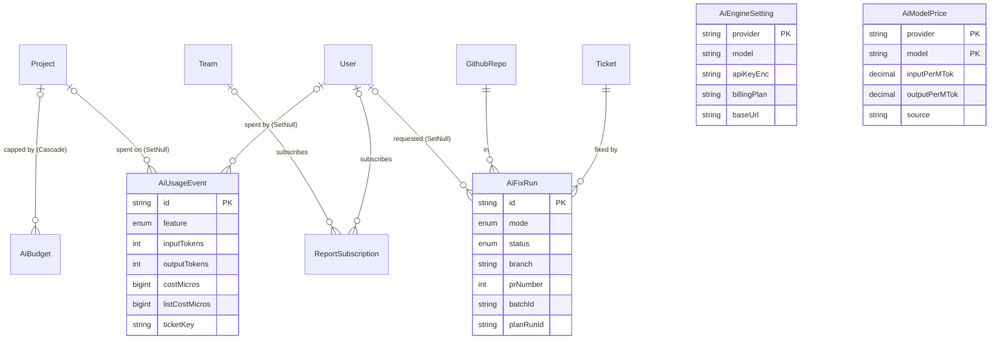

`AiEngineSetting`, `AiWorkspaceSetting`, `AiModelPrice` and `AgentSetting` have no
foreign keys; they are keyed configuration.

---

## 11. Knowledge: memory and documents

| Model | Table | Purpose |
|---|---|---|
| `MemoryChunk` | `memory_chunks` | A piece of project knowledge (`sourceType` `TICKET`, `REPO_DOC` or `HANDBOOK`), split at headings and embedded (384-dimension `real[]`). `hash` skips unchanged text. **Capped at 3,000 per project** (`MAX_CHUNKS_PER_PROJECT` in [`features/memory/index-service.ts`](../src/features/memory/index-service.ts)); turning memory off deletes the project's rows. |
| `ProjectDocument` | `project_documents` | A versioned document; `kind` is `HANDBOOK` today. Every version is kept; `source` is `AI`, `FACTS` or `EDIT`. |
| `ProjectDocumentRead` | `project_document_reads` | The latest version each person has opened, which drives the "read the handbook" banner. Plain ids, no foreign keys. |

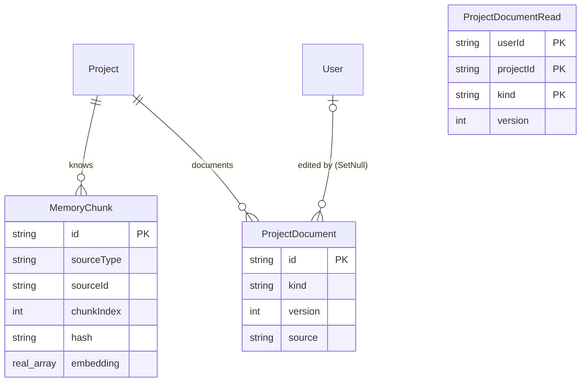

---

## 12. Channels: email in and Microsoft Teams

| Model | Table | Purpose |
|---|---|---|
| `InboundEmailSetting` | `inbound_email_settings` | Singleton: whether email in is on, whether the Copilot structures emails, last poll and error. |
| `InboundEmail` | `inbound_emails` | Every message the mailbox read, keyed uniquely by `messageId`, with its `outcome` (`CREATED`, `COMMENTED`, `REJECTED`, `IGNORED`, `FAILED`). The unique Message-ID is what makes polling idempotent. **Never pruned.** |
| `MsTeamsConversation` | `msteams_conversations` | A Teams chat or channel thread the bot is in, keyed by the Bot Framework conversation id; the linked project, `notify`, and the `draft` ticket being shaped (JSON). |
| `MsTeamsMessage` | `msteams_messages` | Recent turns, kept only as long as the next reply needs; older rows are deleted after each reply. |
| `MsTeamsUser` | `msteams_users` | An Entra object id matched to a TaskForge account by email. |

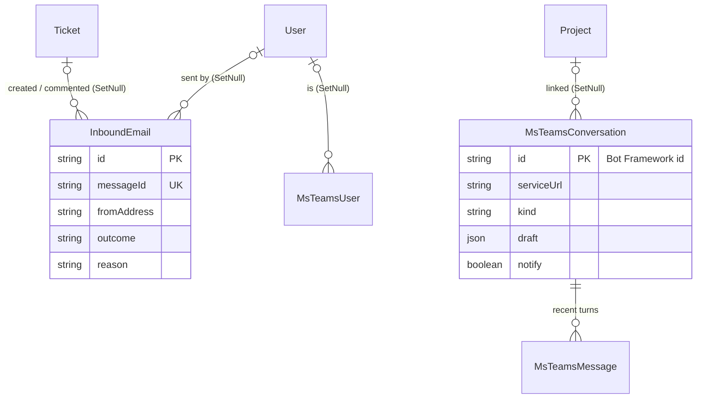

The Teams bot's credentials are not here; they are an `IntegrationSecret` row
with key `msteams`.

---

## 13. Platform: jobs, webhooks, secrets

| Model | Table | Purpose |
|---|---|---|
| `Job` | `jobs` | The background queue: `kind` (`webhook.deliver`, `triage.ticket`, `memory.index`, `handbook.generate`), JSON `payload`, `status` (`PENDING`, `RUNNING`, `DONE`, `FAILED`), `attempts` of `maxAttempts` (5), `runAt`, `lockedAt`, `lastError`, and a unique `dedupeKey`. See [OPERATIONS.md](OPERATIONS.md#the-job-queue). |
| `OutboundWebhook` | `outbound_webhooks` | An HTTP endpoint told about ticket events, for one project or all (`projectId` null), with a sealed signing secret and the last delivery's status. |
| `OutboxCursor` | `outbox_cursor` | Singleton: how far the webhook outbox has read `ticket_status_changes` and `comments`. |
| `IntegrationSecret` | `integration_secrets` | A sealed credential for an integration without a table of its own (`vercel`, `msteams`), with a four-character `hint` and non-secret `meta`. |

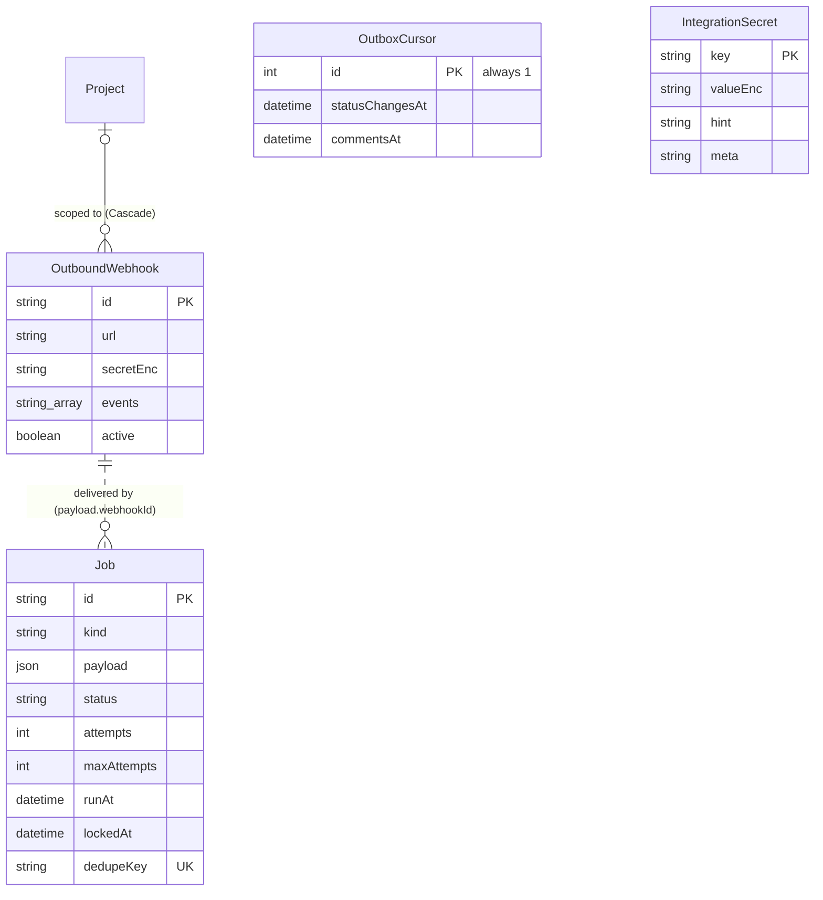

The dotted line is not a foreign key: a delivery job names its webhook inside its
JSON payload. Deleting a webhook deletes its pending and failed jobs explicitly
([`features/webhooks-out/actions.ts`](../src/features/webhooks-out/actions.ts)).

---

## 14. Enums

| Enum | Values | Used by |
|---|---|---|
| `ProjectStatus` | PLANNING, ACTIVE, ON_HOLD, COMPLETED, ARCHIVED | `Project.status` |
| `ProjectMemberRole` | MANAGER, MEMBER, VIEWER | `ProjectMember.role`, `ProjectTeam.role` |
| `StatusCategory` | BACKLOG, TODO, IN_PROGRESS, BLOCKED, REVIEW, DONE, CANCELLED | `Status`, `TemplateStatus`, `TicketStatusChange`. Everything that asks "is this finished?" reads the category, never the status name. |
| `TicketKind` | TASK, FEATURE, ENHANCEMENT, BUG, PRODUCTION, DEPLOYMENT, RESEARCH | `TicketType.kind`, `TemplateTicketType.kind` |
| `TicketLinkType` | BLOCKS, RELATES_TO, DUPLICATES | `TicketLink.type` |
| `CustomFieldType` | TEXT, NUMBER, SELECT, MULTI_SELECT, DATE, CHECKBOX, URL, USER | `CustomField.type` |
| `CycleKind` / `CycleState` | SPRINT, MILESTONE / PLANNED, ACTIVE, CLOSED | `Cycle` |
| `ResourceType` | GITHUB, SHAREPOINT, FIGMA, BUILD, DOCUMENTATION, API_SPEC, OTHER | `TicketResource.type` |
| `RecurrenceFrequency` | DAILY, WEEKLY, BIWEEKLY, MONTHLY, QUARTERLY, YEARLY | `RecurringTicket.frequency` |
| `ActivityEntity` | PROJECT, TICKET, COMMENT, USER, LABEL, MEMBER, RESOURCE, STATUS, PRIORITY, TICKET_TYPE, TEMPLATE, RECURRING_TICKET, ROLE, TEAM, INTEGRATION | `ActivityLog.entityType` |
| `ActivityAction` | 25 verbs, CREATED to AI_GENERATED | `ActivityLog.action` |
| `NotificationType` | MENTIONED, ASSIGNED, COMMENT_REPLY, TICKET_BLOCKED, SLA_AT_RISK, SLA_BREACHED | `Notification.type` |
| `FilterField` / `FilterOperator` / `ViewType` | 14 fields / 10 operators / TABLE, KANBAN, CALENDAR, TIMELINE | `SavedFilter`, `SavedFilterCriterion` |
| `GitRefKind` / `GitRefState` / `GitCheckState` | BRANCH, PULL_REQUEST, COMMIT / OPEN, DRAFT, MERGED, CLOSED / PENDING, SUCCESS, FAILURE | `TicketGitRef` |
| `DeploymentState` | PENDING, QUEUED, IN_PROGRESS, SUCCESS, FAILURE, ERROR, INACTIVE | `Deployment.state` |
| `MonitorState` | UNKNOWN, UP, DOWN | `Monitor.state` |
| `AiFixMode` / `AiFixStatus` | FIX, PLAN, HEAL_CI, SCAFFOLD / QUEUED, RUNNING, SUCCEEDED, NO_CHANGES, FAILED | `AiFixRun` |
| `AiFeature` | COPILOT, AI_FIX, CAPTURE, FILTER, WEEKLY_UPDATE, PR_REVIEW, RELEASE_NOTES, TRIAGE, POSTMORTEM, PLANNING | `AiUsageEvent.feature` |
| `AiBudgetScope` | WORKSPACE, PROJECT, PROVIDER | `AiBudget.scope` |
| `ReportKind` | AI_USAGE_WEEKLY, AI_BUDGET_ALERT | `ReportSubscription.kind` |

Several state columns are **text, not enums**, on purpose, so a new value needs no
migration: `Job.status`, `Job.kind`, `InboundEmail.outcome`, `TimeEntry.source`,
`MemoryChunk.sourceType`, `ProjectDocument.kind` and `.source`,
`MsTeamsConversation.kind`, `MsTeamsMessage.role`, `AiEngineSetting.billingPlan`,
`AiModelPrice.source`, `Role.key` (converted from an enum in
`20260919080811_configurable_roles_and_teams`). The allowed values are listed in the
schema's doc comments and enforced in code.

Adding a value to a real enum is `ALTER TYPE … ADD VALUE`, which Postgres allows
inside a transaction only if nothing in that same migration uses the new value
(see `20260930140000_ai_feature_kinds`).

---

## 15. Objects created in raw SQL

Prisma's schema language cannot express these, so they exist only in migration
SQL. `prisma migrate dev` does not know about them and will propose dropping some
of them on almost every new migration; see
[DEPLOYMENT.md](DEPLOYMENT.md#writing-a-migration).

### Generated column and search indexes

| Object | Migration | What |
|---|---|---|
| `tickets."searchVector"` | `20260918133000_ticket_fulltext_search` | `tsvector GENERATED ALWAYS AS (…) STORED`: title weighted A, description B, remarks C, English configuration. Kept in step by Postgres, no trigger. |
| `tickets_search_idx` | same | `GIN ("searchVector")`, serving `@@ plainto_tsquery` with `ts_rank`. |
| `pg_trgm` extension, `tickets_key_trgm_idx` | same | `GIN ("key" gin_trgm_ops)`, so a partial key such as `ATLAS-1` matches quickly. |

### Partial indexes

| Index | Migration | Definition | Why |
|---|---|---|---|
| `tickets_embedding_pending_idx` | `20260920060000_ticket_embeddings` | `ON tickets ("projectId") WHERE "embedding" IS NULL` | Lets the embedding sweep find unembedded rows cheaply; usually matches nothing. |
| `cycles_one_active_sprint` | `20261002020000_cycles_and_backlog` | `UNIQUE ON cycles ("projectId") WHERE "state" = 'ACTIVE' AND "kind" = 'SPRINT'` | At most one running sprint per project; milestones may overlap. Violations surface as Prisma `P2002`. |
| `time_entries_one_running` | `20261002030000_time_tracking` | `UNIQUE ON time_entries ("userId") WHERE "endedAt" IS NULL` | At most one running timer per person. |

### Triggers

All in plpgsql, timestamps written in UTC as Prisma writes them.

| Trigger | On | Function | Effect |
|---|---|---|---|
| `tickets_status_before` | `BEFORE INSERT OR UPDATE OF "statusId" ON tickets` | `taskforge_ticket_status_before()` | Sets `statusChangedAt` (to `createdAt` on insert, now on a change) and, on the first move out of a BACKLOG/TODO category, `firstResponseAt`. |
| `tickets_status_after` | `AFTER INSERT OR UPDATE OF "statusId" ON tickets` | `taskforge_ticket_status_after()` | Inserts a `ticket_status_changes` row with from/to status and snapshotted categories. The first row of a ticket is its creation. |
| `comments_first_response` | `AFTER INSERT ON comments` | `taskforge_comment_first_response()` | Sets the ticket's `firstResponseAt` on the first comment by someone other than the reporter who is not an agent. |
| `tickets_cycle_after` | `AFTER INSERT OR UPDATE OF "cycleId" ON tickets` | `taskforge_ticket_cycle_after()` | Inserts a `ticket_cycle_changes` row, including when a deleted cycle releases its tickets (Postgres performs `SET NULL` as an update, which fires the trigger). |

Consequences worth knowing:

- Application code never writes `ticket_status_changes` or `ticket_cycle_changes`.
  A bulk `UPDATE tickets SET "statusId" = …` in SQL writes history too, which is
  the point.
- `20261002010000_status_history_and_sla` backfilled status history for existing
  tickets from `activity_logs`, so history predates the trigger.
- A restore with `pg_dump`/`pg_restore` carries the triggers and functions; a
  restore that uses `prisma db push` would not. Always restore from a dump or by
  replaying migrations.

### Data migrations

Some migrations also change data, not just shape. The notable ones: the roles
migration converts `users.role` from an enum to a `roles` table and reproduces the
old permission matrix as rows; `20260929090000_github_integration` backfills
`TicketType.kind` from type names; `20260930200000_billing_plans` moves a
hand-typed price into the custom rate and estimates missing list costs;
`20261001000000_avatars_and_role_colors` colours the built-in roles;
`20261002000000_checklists_and_templates` gives existing types their description
and checklist templates by kind.

---

## 16. Unique constraints

Beyond primary keys:

| Model | Unique | Enforces |
|---|---|---|
| `Role` | `key` | Stable role identifiers |
| `Team`, `ProjectTemplate` | `name` | No two teams or templates share a name |
| `User` | `username`, `email` | Sign-in identity; email is also how SSO, email in and Teams match people |
| `AccessToken` | `tokenHash` | Token lookup |
| `Project` | `code` | Ticket prefix |
| `ProjectSettings` | `projectId`, `errorIngestHash` | One-to-one; ingest token lookup |
| `ProjectMember` | `(projectId, userId)` | One direct membership |
| `Status`, `TicketType`, `Label`, `CustomField` | `(projectId, name)` | Names unique within a project |
| `Priority` | `(projectId, name)`, `(projectId, level)` | Names and levels unique within a project |
| `TemplateStatus` | `(templateId, name)`, `(templateId, position)` | Same, for templates |
| `TemplatePriority` | `(templateId, name)`, `(templateId, level)` | Same |
| `TemplateTicketType`, `TemplateLabel` | `(templateId, name)` | Same |
| `Ticket` | `key`; `(projectId, number)`; `(projectId, externalRef)` | Human keys, gap-free numbering per project, idempotent import (NULL `externalRef` values do not collide) |
| `TicketLink` | `(sourceId, targetId, type)` | A link is stored once |
| `SavedFilter` | `(ownerId, name)` | Per-owner filter names |
| `MemoryChunk` | `(projectId, sourceType, sourceId, chunkIndex)` | One row per chunk; the indexer upserts on it |
| `ProjectDocument` | `(projectId, kind, version)` | Linear version history |
| `InboundEmail` | `messageId` | Each email handled once |
| `Job` | `dedupeKey` | Queuing the same key twice while the first is pending is a no-op (cleared to NULL when a job finishes or fails) |
| `GithubApp` | `appId` | |
| `GithubInstallation` | `installationId` | |
| `GithubRepo`, `Deployment` | `githubId` | GitHub's own ids |
| `TicketGitRef` | `(ticketId, repoId, kind, externalId)` | The idempotent upsert target for webhooks and reconciliation |
| `ErrorGroup` | `(projectId, fingerprint)` | One group per distinct error per project |
| `AiBudget` | `(scope, projectId, provider)` | One budget per target. Postgres treats NULLs as distinct, so this does not by itself stop two workspace budgets; the action checks with `findFirst` before creating |
| `ReportSubscription` | `(kind, userId)`, `(kind, teamId)` | One subscription per person or team per report |
| Partial | `cycles_one_active_sprint`, `time_entries_one_running` | See [section 15](#partial-indexes) |

Composite primary keys double as uniqueness for the join tables:
`RolePermission (roleId, permission)`, `TeamMember`, `ProjectTeam`,
`TicketLabel`, `TicketWatcher`, `CommentMention`, `RecurringTicketLabel`,
`TemplateTicketLabel`, `ProjectRepo`, `TicketDeployment`, `TicketFieldValue`,
`TicketSlaAlert (ticketId, kind)`, `ProjectDocumentRead`, `AiModelPrice`.

---

## 17. Cascade rules

Every relation declares its action. The pattern:

| Rule | Relations | Why |
|---|---|---|
| **Cascade from Project** | settings, members, teams, statuses, priorities, types, labels, tickets, cycles, custom fields, recurring tickets, saved filters, repos links, budgets, monitors, error groups, memory chunks, documents, outbound webhooks, activity logs | Deleting a project removes everything that only makes sense inside it. Projects are normally archived (`isArchived`), not deleted. |
| **Cascade from Ticket** | labels, links (both ends), watchers, attachments (and their bytes), resources, checklist, comments, status and cycle history, SLA alerts, time entries, field values, git refs, deployments links, fix runs, triage runs, notifications, activity logs | A ticket's satellites go with it. |
| **Cascade from User** | role permissions no; team memberships, project memberships, watchers, mentions, access tokens, sessions, avatar, GitHub token, saved filters, notifications received, **comments authored** | Users are deactivated, not deleted, in normal operation. Deleting one would delete their comments; that is why the UI offers deactivation only. |
| **Restrict** | `Ticket → Status / Priority / TicketType`, `RecurringTicket → Status / Priority / TicketType`, `User → Role`, `Project → owner User` | A status in use cannot be deleted until its tickets move; a role in use cannot be deleted; a user who owns a project cannot be deleted. The UI moves tickets before deleting a status. |
| **SetNull** | ticket assignee, reporter, creator, parent, cycle, recurring source; `createdBy` / `addedBy` everywhere; `Project.template`; `ProjectSettings.defaultAssignee`; `TimeEntry.user`; `AiUsageEvent.user` and `.project`; `AiFixRun.requestedBy`; `ErrorGroup.ticket`; `InboundEmail.ticket` and `.user`; `MsTeamsConversation.project`; `MsTeamsUser.user`; `ActivityLog.actor`; `Notification.actor`; `ProjectDocument.author` | The row is a record that must outlive what it points at: history, spend, billed time, the email log. |
| **Cascade within integrations** | `GithubInstallation → GithubRepo → ProjectRepo / TicketGitRef / Deployment / AiFixRun`; `Deployment → TicketDeployment`; `Monitor → MonitorCheck`; `MsTeamsConversation → MsTeamsMessage`; `Comment → replies / mentions / notifications`; `TicketAttachment → TicketAttachmentData` | Installations and repositories are marked removed or inaccessible rather than deleted, so this cascade is rarely exercised. |

`TicketStatusChange` and `TicketCycleChange` hold status and cycle ids as plain
text, so deleting a status or cycle does not touch history.

---

## 18. Index coverage for hot queries

| Query | Where it runs | Index |
|---|---|---|
| Board: a project's tickets by column, in order | Board, live refresh | `tickets(projectId, statusId, position)` |
| Project ticket list without archived | Table, Tree, Calendar, Timeline | `tickets(projectId, isArchived)` |
| My tickets by status | My Tickets, dashboard | `tickets(assigneeId, statusId)` |
| Children of a parent, rollup | Tree, ticket page | `tickets(parentId)` |
| Due and overdue | Calendar, digest, SLA | `tickets(dueDate)` |
| Ticket by key | Every ticket URL, palette, API, MCP, email and git ref parsing | `tickets.key` unique; partial keys via `tickets_key_trgm_idx` |
| Full-text search | Palette, Copilot `search_tickets`, API `q=` | `tickets_search_idx` (GIN) |
| Filter by priority, type, reporter, cycle, recurring source | Filters | `tickets(priorityId)`, `(typeId)`, `(reporterId)`, `(cycleId)`, `(recurringTicketId)` |
| Label filter | Filters | `ticket_labels(labelId)` |
| Import re-run | Import | `tickets(projectId, externalRef)` unique |
| Unembedded tickets | Daily sweep | `tickets_embedding_pending_idx` (partial) |
| Comment thread | Ticket page | `comments(ticketId, createdAt)` |
| Unread badge and inbox | Every page (layout) | `notifications(userId, readAt, createdAt)` |
| Project and ticket timelines | Activity pages | `activity_logs(projectId, createdAt)`, `(ticketId, createdAt)`, `(actorId, createdAt)`, `(entityType, entityId)` |
| Time in status, where work waits | Ticket page, Insights | `ticket_status_changes(ticketId, changedAt)` |
| Throughput for forecasts and DORA, outbox sweep | Plan, Insights, webhooks | `ticket_status_changes(changedAt)` |
| Burn-up scope | Cycle page | `ticket_cycle_changes(toCycleId)`, `(fromCycleId)`, `(ticketId, changedAt)` |
| Open cycles | Plan | `cycles(projectId, state)` |
| Backlog order | Plan | `tickets(projectId, isArchived)` then sorted by `backlogRank` in the query (no dedicated index) |
| Timesheet, running timer | Time page, header | `time_entries(userId, startedAt)`, `time_entries_one_running` |
| Due recurrences | Daily cron | `recurring_tickets(isActive, nextRunAt)` |
| Due jobs | Every drain | `jobs(status, runAt)`; queue summary `jobs(kind, status)` |
| Due monitors | Five-minute cron | `monitors(isActive, lastCheckedAt)` |
| Uptime percentage | Monitors card | `monitor_checks(monitorId, checkedAt)` |
| Git refs by head commit, merge commit | CI and deployment webhooks | `ticket_git_refs(repoId, headSha)`, `(repoId, mergeCommitSha)`, `(repoId, kind, externalId)` |
| Latest production deployment | Delivery, DORA, rollback | `deployments(repoId, isProduction, state, createdAt)`, `(repoId, sha)` |
| Spend by month, project, person, provider | Workspace → AI, budgets | `ai_usage_events(createdAt)`, `(projectId, createdAt)`, `(userId, createdAt)`, `(provider, createdAt)` |
| Fix runs on a ticket, running runs, batch | Ticket page | `ai_fix_runs(ticketId, createdAt)`, `(status)`, `(batchId)` |
| Memory search | Copilot `search_memory`, agents | `memory_chunks(projectId)`; similarity is computed over the project's rows (at most 3,000) |
| Field value filter | Filters, rules | `ticket_field_values(fieldId, value)` |
| Teams thread history | Bot reply | `msteams_messages(conversationId, createdAt)` |
| Email log | Integrations | `inbound_emails(createdAt)` |
| Permission checks | Every guarded request | `project_members(projectId, userId)` unique, `(userId)`, `(projectId, role)`; `team_members(userId)`; `project_teams(teamId)`; `role_permissions(permission)` |

Known gaps, acceptable at current scale:

- The live-update version (`/api/live`) takes `max(updatedAt)` over a project's
  tickets and `max(createdAt)` over its comments. There is no
  `(projectId, updatedAt)` index; it scans the project's index range.
- Semantic similarity is brute force over a project's `real[]` vectors, not an
  ANN index. pgvector was rejected because it is not in a stock Postgres image
  (see `20260920060000_ticket_embeddings` and [ROADMAP.md](ROADMAP.md)).

---

## 19. Normalisation notes and deliberate exceptions

The schema is in third normal form except where noted.

**Deliberate denormalisations**

- `tickets.key` duplicates `project.code` + `number`, so a key lookup is one index
  hit.
- `activity_logs.entityLabel` and `notifications.title` are rendered at write time,
  so they read correctly after a rename or deletion.
- `ai_usage_events.costMicros` snapshots the price at call time, so editing a
  price does not rewrite history.
- `ticket_status_changes.fromCategory/toCategory` snapshot the category, so moving
  a status to another category does not rewrite the past.
- `tickets.statusChangedAt` and `firstResponseAt` are derivable from history but
  kept on the row (by trigger) because every board card and SLA clock reads them.

**Where JSON is used, and why it is acceptable**

The original design had no JSON columns. Five now exist, each for a value that is
written and read whole and never filtered on:

| Column | Holds |
|---|---|
| `jobs.payload` | A job's arguments |
| `cycles.summary` | The closing summary of a cycle |
| `bulk_operations.changes` | Before-values for undo |
| `triage_runs.changes` | `{ field: { from, to } }` for undo |
| `msteams_conversations.draft` | The ticket being shaped in Teams |

Saved-filter criteria and audit diffs, the two places a JSON blob would be
tempting and would hurt, remain relational.

**Arrays**

`Status.requirements`, `TicketType.checklistTemplate`, `CustomField.options`,
`OutboundWebhook.events` and `MsTeamsConversation.draftParticipants` are Postgres
`text[]`: short, ordered, owned by one row, and never joined against.
